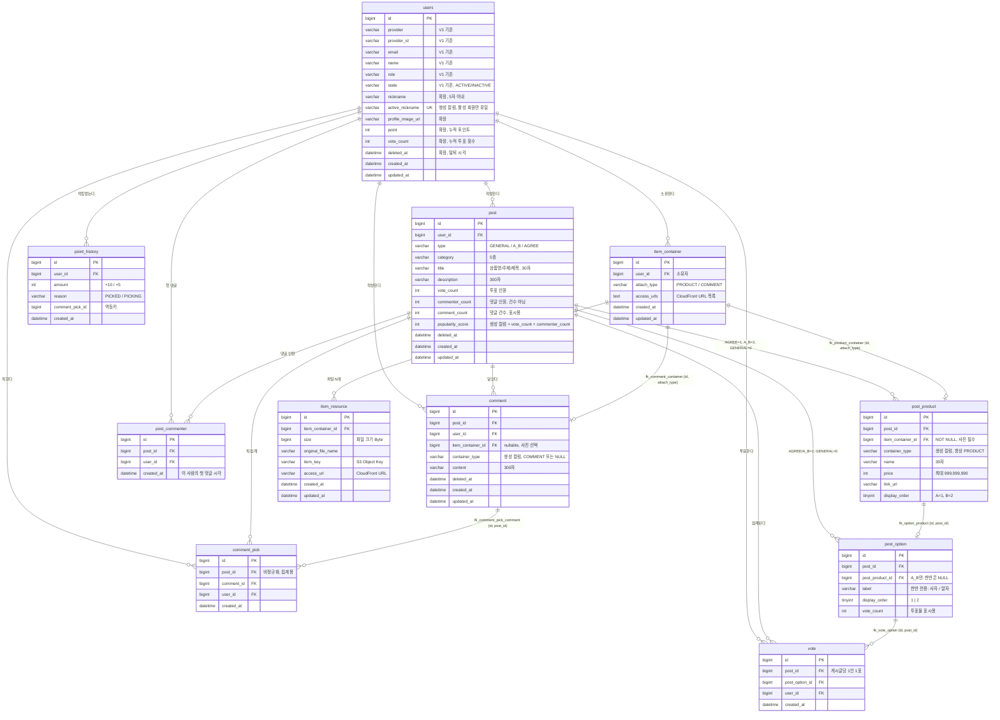

# Pickple ERD 2차 — 코어 도메인

**상태**: 2차 · 팀 합의 코어 범위 · **대상 DBMS**: MySQL 8.4 · **작성일**: 2026-08-31

[ERD 초안](./ERD-초안.md)(개인 전체 범위, 08-29)과 화이트보드 합본 1차(08-30)를 병합하고,
1차에 달린 리뷰 지적 4건을 반영한 결과다.

구조는 화이트보드 합의를 따르고, **제약과 DDL은 초안을 정본으로 계승**한다.
1차가 초안에서 옮겨오지 못한 제약이 지적의 상당수를 차지했기 때문이다(§2).

---

## 1. 범위

### 1.1 포함 — 11개 테이블

`users`(기존 확장) · `post` · `post_product` · `post_option` · `vote` ·
`comment` · `comment_pick` · `post_commenter` · `point_history` ·
`item_container` · `item_resource`

1차(10개) 대비 `post_commenter`가 추가됐다. 유예했다가 되살린 것으로, 사유는 [§2.4](#24-commenter_count-원자적-집계).

### 1.2 유예 — 삭제가 아니라 다음 범위

| 유예 대상 | 사유 |
|---|---|
| `grade` / `level_definitions` | 화이트보드에 없음. 등급은 `users.point`·`vote_count` 누적값으로 판정 가능 |
| `badge` / `user_badge` | 정책표 §3의 뱃지 8종은 확정됐으나 코어 흐름 밖 |
| `user_daily_activity` | 일별·연속 뱃지 판정용. 뱃지와 함께 |
| `categories` | 정책표 §6상 5종 고정 → `post.category` + `CHECK` |
| `guest_devices` | 게스트 투표는 서버에 저장하지 않는다(초안 2.1) |
| `post_results` | 마감(`closes_at`) 정책 미확정 |

---

## 2. 리뷰 지적 반영

지적 4건 중 **2건은 신규 설계, 2건은 초안에 이미 있던 제약의 복원**이었다.
1차가 화이트보드 합본 과정에서 초안 DDL을 축약하며 빠뜨린 것이다.

| # | 지적 | 성격 | 조치 | 검증 |
|---|---|---|---|---|
| 1 | `item_container` 재사용 금지가 UNIQUE로 보장되지 않는다 | 신규 결함 | 용도 태그 + 복합 FK ([§2.1](#21-컨테이너의-단일-부착)) | V-1 |
| 2 | `post_product.item_container_id`가 nullable이면 정책과 어긋난다 | 신규 결함 | `NOT NULL` ([§2.2](#22-상품-사진은-필수다)) | V-2 |
| 3 | 복합 FK를 "계승"이라 쓰지 말고 `post_option`·`vote`까지 명시하라 | 복원 | 초안 DDL 그대로 ([§2.3](#23-복합-fk를-말이-아니라-제약으로)) | V-3 |
| 4 | 인기순 원본을 "구현 시점에 결정"으로 남기지 말라 | 복원 | `post_commenter` 부활 + 생성 컬럼 ([§2.4](#24-commenter_count-원자적-집계)) | V-4, V-5 |

### 2.1 컨테이너의 단일 부착

1차는 `post_product`와 `comment`에 각각 `UNIQUE(item_container_id)`를 두고 "컨테이너 재사용 금지"라 적었다.
**이 제약은 테이블 내부에서만 유일하다.** 컨테이너 #7이 상품 하나와 댓글 하나에 동시에 붙어도
각 테이블 입장에선 한 번씩만 쓰인 것이라 위반이 아니다.

근본 원인은 1차가 polymorphic FK를 피하려고 소유 방향을 뒤집은 데 있다.
컨테이너가 자기 부착지를 모르게 되면서, **"부착지는 하나"라는 전역 제약을 적을 자리가 사라졌다.**

컨테이너에 용도를 못박고, 부착 측이 복합 FK로 참조한다.

```sql
-- 컨테이너는 생성 시점에 용도가 정해진다
UNIQUE KEY uk_container_id_type (id, attach_type)

-- 상품용 컨테이너를 댓글에 붙이려면 (7, 'COMMENT') 부모 행이 있어야 하는데, 없다
CONSTRAINT fk_comment_container
    FOREIGN KEY (item_container_id, container_type)
    REFERENCES item_container (id, attach_type)
```

컨테이너 #7이 `PRODUCT`면 `comment`는 `(7, 'COMMENT')`를 참조해야 하고, 그런 부모 행이 없어 FK가 거부한다.
같은 용도 안에서의 중복은 각 테이블의 `UNIQUE(item_container_id)`가 막는다. **트리거가 필요 없다.**

부착 측의 `container_type`은 생성 컬럼이라 애플리케이션이 값을 넣지 않는다.
잘못된 값을 넣을 경로 자체가 없다.

> 이 방법을 고른 이유는 초안이 `post_option`·`vote`에서 이미 쓰는 기법과 **같은 패턴**이기 때문이다([§2.3](#23-복합-fk를-말이-아니라-제약으로)).
> 새 장치를 들이지 않고 이미 검증된 도구를 한 번 더 쓴다.

### 2.2 상품 사진은 필수다

정책표 §5는 찬반·A/B 모두 상품 사진을 필수로 둔다. 1차는 `post_product.item_container_id`를 nullable로 뒀는데,
"일반 게시글은 사진이 없다"를 근거로 삼은 것이었다.

**일반 게시글은 `post_product` 행 자체가 0개다.** 행의 존재 여부로 갈리는 문제를 컬럼의 NULL 허용으로 표현한 셈이라,
근거가 성립하지 않는다. 상품이 있다는 것은 사진이 있다는 뜻이다.

→ `post_product.item_container_id`는 `NOT NULL`. `comment.item_container_id`는 댓글 사진이 선택이므로 nullable을 유지한다.

**한계 — DB로 강제할 수 없는 것**: 상품에 컨테이너가 반드시 붙는 것은 위 제약이 보장하지만,
그 컨테이너에 `item_resource`가 1장 이상 있는지는 강제할 수 없다.
컨테이너가 먼저 있어야 상품이 생기고, 리소스는 그 뒤에 붙기 때문이다(순환 의존).
장수 제약(찬반 1~3장, A/B 각 1장)과 함께 애플리케이션 트랜잭션에서 검증한다([§7](#7-미결)).

### 2.3 복합 FK를 말이 아니라 제약으로

1차는 "복합 FK로 교차 게시글 참조 차단"을 계승 항목에 한 줄로 적고, DDL에는 `comment_pick`만 옮겼다.
**원칙만 선언되고 집행이 빠진 상태였다.**

FK는 "그 행이 존재한다"만 보장하지 "그 행이 이 게시글의 것이다"는 보장하지 않는다. 뚫린 곳은 셋이다.

| 뚫린 곳 | 단순 FK로는 | 결과 |
|---|---|---|
| `post_option.post_product_id` | 상품이 존재하면 통과 | 게시글 A의 선택지가 게시글 B의 상품을 가리킴 |
| `vote.post_option_id` | 선택지가 존재하면 통과 | 게시글 A에 투표하며 게시글 B의 선택지를 고름 |
| `comment_pick.comment_id` | 댓글이 존재하면 통과 | 다른 게시글의 댓글을 픽 |

이런 행은 FK·UNIQUE·CHECK를 **전부 만족시키면서** 성립한다. UI에서는 만들어지지 않지만
API 구현 실수, 오래 열린 화면의 낡은 ID, 직접 호출로는 들어온다.

막는 방법은 자식이 부모를 참조할 때 `post_id`를 함께 넘기는 것이다.
그러려면 부모에 그 조합의 유니크 키가 있어야 한다.

```sql
-- 부모: 복합 FK의 대상이 될 유니크 키
ALTER TABLE post_product ADD UNIQUE KEY uk_product_id_post (id, post_id);
ALTER TABLE post_option  ADD UNIQUE KEY uk_option_id_post  (id, post_id);
ALTER TABLE comment      ADD UNIQUE KEY uk_comment_id_post (id, post_id);

-- 자식: 쌍으로 참조
ALTER TABLE post_option  ADD CONSTRAINT fk_option_product
    FOREIGN KEY (post_product_id, post_id) REFERENCES post_product (id, post_id);
ALTER TABLE vote         ADD CONSTRAINT fk_vote_option
    FOREIGN KEY (post_option_id, post_id) REFERENCES post_option (id, post_id);
ALTER TABLE comment_pick ADD CONSTRAINT fk_comment_pick_comment
    FOREIGN KEY (comment_id, post_id) REFERENCES comment (id, post_id);
```

선택지에는 `UNIQUE(post_id, display_order)`도 둔다. 게시글당 1번·2번이 하나씩임을 보장한다.

### 2.4 `commenter_count` 원자적 집계

1차는 `post_commenter`를 유예하고 "집계 방식은 구현 시점에 정한다"고 미결에 남겼다.
`commenter_count`는 인기순의 입력이므로 이 상태로는 정렬 결과가 흔들린다.

정책표 §6의 인기순은 **인원 수**다. 한 사람이 댓글을 열 번 달아도 1이다.
`comment`를 세면 건수가 되어 혼자 순위를 올릴 수 있고,
`SELECT COUNT(DISTINCT user_id)` 후 `UPDATE`하는 방식은 동시 댓글에서 read-modify-write 경합으로 값이 틀어진다.

`post_commenter(post_id, user_id)`에 `UNIQUE`를 걸고, **삽입의 성공 여부로 첫 댓글을 판정한다.**

```sql
INSERT IGNORE INTO post_commenter (post_id, user_id, created_at)
VALUES (:postId, :userId, NOW());            -- 영향 행 0이면 이미 있던 작성자

-- 영향 행이 1일 때만
UPDATE post SET commenter_count = commenter_count + 1 WHERE id = :postId;
```

> **`ON DUPLICATE KEY UPDATE` 가 아니라 `INSERT IGNORE` 다** (2026-09-01 구현 중 정정).
> ODKU 로 `post_id = post_id` 를 넣으면 값이 그대로라 MySQL 이 이를 "변경 없음"으로
> 볼지 "갱신함"으로 볼지가 드라이버·설정에 따라 갈려, 영향 행 수를 첫 댓글 판정에 쓸 수 없다.
> 실제로 JPA 경로에서 두 번째 호출이 "첫 댓글"로 판정되는 것을 통합 테스트가 잡았다.
> `INSERT IGNORE` 는 삽입되면 1, 유니크로 걸리면 0 으로 명확하다.

판정을 애플리케이션이 아니라 유니크 키가 하므로 동시 요청에서도 한 번만 증가한다.

`popularity_score`도 가변 컬럼이 아니라 생성 컬럼으로 둔다.
값을 따로 갱신하는 코드가 없으면 두 카운터와 어긋날 수 없다.

```sql
popularity_score INT UNSIGNED
    GENERATED ALWAYS AS (vote_count + commenter_count) STORED
```

`STORED`라 정렬 인덱스를 걸 수 있다. 두 값을 사전식으로 정렬하면 정책과 다른 순서가 나오므로 합으로 둔다.

---

## 3. 코어 ERD



---

## 4. DDL

타입 선택 원칙은 초안 §5.1을 그대로 따른다 — PK는 `BIGINT AUTO_INCREMENT`, 시간은 `DATETIME`(ADR-0003),
코드값은 `VARCHAR` + 컬럼 COMMENT, 금액은 `INT UNSIGNED`, 문자셋 `utf8mb4`.

```sql
-- =========================================================
-- Pickple 도메인 코어 — 게시글·투표·댓글·원픽·포인트·이미지
--
-- 실제 마이그레이션 파일로 옮길 때 src/main/resources/db/migration 에서
-- 비어 있는 번호를 먼저 확인한다. (V1=인증, V2=Apple 로그인 #12)
-- =========================================================

-- ---------------------------------------------------------
-- 회원 확장 — 기존 users 에 서비스 프로필을 추가한다.
-- 등급(grade_id)은 유예 범위이므로 넣지 않는다.
-- ---------------------------------------------------------
ALTER TABLE users
    ADD COLUMN nickname          VARCHAR(5)   DEFAULT NULL COMMENT '5자 이내',
    ADD COLUMN profile_image_url VARCHAR(500) DEFAULT NULL COMMENT 'NULL이면 랜덤 기본 프로필',

    ADD COLUMN point             INT UNSIGNED NOT NULL DEFAULT 0 COMMENT 'point_history 합계',
    ADD COLUMN vote_count        INT UNSIGNED NOT NULL DEFAULT 0 COMMENT 'vote 건수',

    ADD COLUMN deleted_at        DATETIME     DEFAULT NULL COMMENT '탈퇴 시각. NULL이면 활성',

    -- 활성 회원만 유일. 탈퇴하면 NULL이 되어 닉네임이 풀린다.
    -- 유니크 키는 NULL을 서로 다르게 취급하므로 탈퇴자끼리는 충돌하지 않는다.
    ADD COLUMN active_nickname   VARCHAR(5)
        GENERATED ALWAYS AS (CASE WHEN deleted_at IS NULL THEN nickname END) STORED,
    ADD UNIQUE KEY uk_users_active_nickname (active_nickname),

    -- TOP 피커 랭킹: 포인트 내림차순, 동점자는 가입일 빠른 순
    ADD KEY idx_users_ranking (point DESC, created_at);


-- ---------------------------------------------------------
-- 이미지 컨테이너
--
-- attach_type 은 생성 시점에 정해지고 바뀌지 않는다.
-- 부착 측이 (id, attach_type) 쌍으로 참조하므로,
-- 상품용 컨테이너가 댓글에 붙는 경로가 없다. (2.1 참조)
-- ---------------------------------------------------------
CREATE TABLE item_container (
    id          BIGINT       NOT NULL AUTO_INCREMENT,
    user_id     BIGINT       NOT NULL COMMENT '업로더',
    attach_type VARCHAR(20)  NOT NULL COMMENT 'PRODUCT | COMMENT',

    access_urls TEXT         DEFAULT NULL COMMENT 'CloudFront Access URL 목록',

    created_at  DATETIME     NOT NULL,
    updated_at  DATETIME     NOT NULL,

    PRIMARY KEY (id),

    -- 부착 측 복합 FK의 대상
    UNIQUE KEY uk_container_id_type (id, attach_type),

    CONSTRAINT fk_container_user FOREIGN KEY (user_id) REFERENCES users (id),
    CONSTRAINT ck_container_type CHECK (attach_type IN ('PRODUCT', 'COMMENT'))
) ENGINE=InnoDB DEFAULT CHARSET=utf8mb4;


CREATE TABLE item_resource (
    id                 BIGINT       NOT NULL AUTO_INCREMENT,
    item_container_id  BIGINT       NOT NULL,

    size               BIGINT       NOT NULL COMMENT '파일 크기 (Byte)',
    original_file_name VARCHAR(255) NOT NULL,
    item_key           VARCHAR(500) NOT NULL COMMENT 'S3 Object Key',
    access_url         VARCHAR(500) NOT NULL COMMENT 'CloudFront Access URL',

    created_at         DATETIME     NOT NULL,
    updated_at         DATETIME     NOT NULL,

    PRIMARY KEY (id),

    CONSTRAINT fk_resource_container FOREIGN KEY (item_container_id)
        REFERENCES item_container (id) ON DELETE CASCADE,

    KEY idx_resource_container (item_container_id)
) ENGINE=InnoDB DEFAULT CHARSET=utf8mb4;


-- ---------------------------------------------------------
-- 게시글 — 3유형을 한 테이블로 다룬다 (초안 8.1)
-- ---------------------------------------------------------
CREATE TABLE post (
    id               BIGINT       NOT NULL AUTO_INCREMENT,
    user_id          BIGINT       NOT NULL,

    type             VARCHAR(20)  NOT NULL COMMENT 'GENERAL | A_B | AGREE',
    category         VARCHAR(20)  NOT NULL COMMENT 'FASHION | ELECTRONICS | BEAUTY | LIVING | ETC',

    -- 찬반=상품명, A/B=주제, 일반=제목. 셋 다 30자라 한 컬럼으로 받는다.
    title            VARCHAR(30)  NOT NULL,
    description      VARCHAR(300) DEFAULT NULL,

    -- 정책표 §6의 인기순은 건수가 아니라 인원 수다. (2.4 참조)
    vote_count       INT UNSIGNED NOT NULL DEFAULT 0 COMMENT '투표한 사람 수 (1인 1표라 건수와 같다)',
    commenter_count  INT UNSIGNED NOT NULL DEFAULT 0 COMMENT '댓글을 단 사람 수. 건수가 아니다',
    comment_count    INT UNSIGNED NOT NULL DEFAULT 0 COMMENT '댓글 건수 (표시용)',

    -- 갱신 코드가 없으므로 두 카운터와 어긋날 수 없다. (2.4 참조)
    popularity_score INT UNSIGNED
                     GENERATED ALWAYS AS (vote_count + commenter_count) STORED,

    deleted_at       DATETIME     DEFAULT NULL,
    created_at       DATETIME     NOT NULL,
    updated_at       DATETIME     NOT NULL,

    PRIMARY KEY (id),

    -- 자식이 "같은 게시글의 것"임을 참조하기 위한 대상 키
    UNIQUE KEY uk_post_id_user (id, user_id),

    CONSTRAINT fk_post_user FOREIGN KEY (user_id) REFERENCES users (id),

    -- keyset 커서가 (정렬키, id)이므로 복합으로 건다 (초안 5.4)
    KEY idx_post_latest      (deleted_at, category, created_at DESC, id DESC),
    KEY idx_post_popular     (deleted_at, category, popularity_score DESC, id DESC),

    -- 카테고리 "전체"는 category 가 선행 컬럼이면 정렬에 쓰이지 못해 filesort 로 떨어진다
    KEY idx_post_latest_all  (deleted_at, created_at DESC, id DESC),
    KEY idx_post_popular_all (deleted_at, popularity_score DESC, id DESC),

    KEY idx_post_user (user_id, deleted_at, created_at DESC),

    CONSTRAINT ck_post_type     CHECK (type IN ('GENERAL', 'A_B', 'AGREE')),
    CONSTRAINT ck_post_category CHECK (category IN ('FASHION', 'ELECTRONICS', 'BEAUTY', 'LIVING', 'ETC'))
) ENGINE=InnoDB DEFAULT CHARSET=utf8mb4;


-- ---------------------------------------------------------
-- 상품 — AGREE 1개, A_B 2개, GENERAL 0개
--
-- item_container_id 가 NOT NULL 인 이유는 2.2 참조.
-- 일반 게시글은 이 테이블에 행 자체가 없다.
-- ---------------------------------------------------------
CREATE TABLE post_product (
    id                BIGINT        NOT NULL AUTO_INCREMENT,
    post_id           BIGINT        NOT NULL,

    item_container_id BIGINT        NOT NULL COMMENT '상품 사진은 필수다 (2.2)',

    -- 생성 컬럼은 GENERATED ... STORED 뒤에 NOT NULL 이 온다 (순서를 바꾸면 문법 오류)
    container_type    VARCHAR(20)
                      GENERATED ALWAYS AS (_utf8mb4'PRODUCT') STORED NOT NULL,

    name              VARCHAR(30)   NOT NULL COMMENT '상품명 30자',
    price             INT UNSIGNED  DEFAULT NULL COMMENT '선택. 상한 999,999,999',
    link_url          VARCHAR(2048) DEFAULT NULL,

    display_order     TINYINT       NOT NULL DEFAULT 1 COMMENT 'A=1, B=2',

    created_at        DATETIME      NOT NULL,
    updated_at        DATETIME      NOT NULL,

    PRIMARY KEY (id),
    UNIQUE KEY uk_product_post_order (post_id, display_order),

    -- 자식(post_option)이 "같은 게시글의 상품"만 참조하도록 (2.3)
    UNIQUE KEY uk_product_id_post (id, post_id),

    -- 한 컨테이너는 한 상품에만
    UNIQUE KEY uk_product_container (item_container_id),

    CONSTRAINT fk_product_post FOREIGN KEY (post_id) REFERENCES post (id) ON DELETE CASCADE,

    -- 용도가 PRODUCT 인 컨테이너만 붙는다 (2.1)
    CONSTRAINT fk_product_container FOREIGN KEY (item_container_id, container_type)
        REFERENCES item_container (id, attach_type),

    CONSTRAINT ck_product_price CHECK (price IS NULL OR price <= 999999999),
    CONSTRAINT ck_product_order CHECK (display_order IN (1, 2))
) ENGINE=InnoDB DEFAULT CHARSET=utf8mb4;


-- ---------------------------------------------------------
-- 투표 선택지 — AGREE/A_B 각 2행, GENERAL 0행
-- AGREE: post_product_id NULL, label='사자'/'말자'
-- A_B  : post_product_id NOT NULL, label NULL
-- ---------------------------------------------------------
CREATE TABLE post_option (
    id              BIGINT       NOT NULL AUTO_INCREMENT,
    post_id         BIGINT       NOT NULL,
    post_product_id BIGINT       DEFAULT NULL COMMENT 'A_B만 사용. 찬반은 NULL',

    label           VARCHAR(20)  DEFAULT NULL COMMENT '찬반 전용: 사자 | 말자',
    display_order   TINYINT      NOT NULL COMMENT '1 | 2',

    vote_count      INT UNSIGNED NOT NULL DEFAULT 0 COMMENT '투표율 표시용',

    created_at      DATETIME     NOT NULL,

    PRIMARY KEY (id),

    -- 게시글당 1번·2번이 하나씩 (2.3)
    UNIQUE KEY uk_option_post_order (post_id, display_order),

    -- vote 가 "같은 게시글의 선택지"만 참조하도록 (2.3)
    UNIQUE KEY uk_option_id_post (id, post_id),

    CONSTRAINT fk_option_post FOREIGN KEY (post_id) REFERENCES post (id) ON DELETE CASCADE,

    -- 단순 FK는 "그 상품이 존재한다"만 보장한다. post_id 를 함께 넘겨 교차 참조를 막는다. (2.3)
    CONSTRAINT fk_option_product FOREIGN KEY (post_product_id, post_id)
        REFERENCES post_product (id, post_id),

    CONSTRAINT ck_option_target CHECK (
        (post_product_id IS NOT NULL AND label IS NULL) OR
        (post_product_id IS NULL     AND label IS NOT NULL)
    ),
    CONSTRAINT ck_option_order CHECK (display_order IN (1, 2))
) ENGINE=InnoDB DEFAULT CHARSET=utf8mb4;


-- ---------------------------------------------------------
-- 투표 — 게시글당 1인 1표
-- post_id 중복 보유는 UNIQUE(post_id, user_id)를 성립시키기 위한 것이다 (초안 6.2)
-- ---------------------------------------------------------
CREATE TABLE vote (
    id             BIGINT   NOT NULL AUTO_INCREMENT,
    post_id        BIGINT   NOT NULL,
    post_option_id BIGINT   NOT NULL,
    user_id        BIGINT   NOT NULL COMMENT '게스트 투표는 서버에 남지 않는다',

    created_at     DATETIME NOT NULL,

    PRIMARY KEY (id),

    -- 재투표는 UPDATE 로 처리한다
    UNIQUE KEY uk_vote_post_user (post_id, user_id),

    CONSTRAINT fk_vote_post FOREIGN KEY (post_id) REFERENCES post (id) ON DELETE CASCADE,

    -- 단순 FK였다면 post_id=1 인 투표가 post_id=2 의 선택지를 가리켜도 통과했다 (2.3)
    CONSTRAINT fk_vote_option FOREIGN KEY (post_option_id, post_id)
        REFERENCES post_option (id, post_id),

    CONSTRAINT fk_vote_user FOREIGN KEY (user_id) REFERENCES users (id),

    KEY idx_vote_user_created (user_id, created_at)
) ENGINE=InnoDB DEFAULT CHARSET=utf8mb4;


-- ---------------------------------------------------------
-- 댓글 — 사진은 선택이므로 컨테이너가 nullable 이다
-- ---------------------------------------------------------
CREATE TABLE comment (
    id                BIGINT       NOT NULL AUTO_INCREMENT,
    post_id           BIGINT       NOT NULL,
    user_id           BIGINT       NOT NULL,

    item_container_id BIGINT       DEFAULT NULL COMMENT '댓글 사진은 선택',
    -- 문자 리터럴은 접속 문자셋을 따르므로, 복합 FK 대상 컬럼과 맞추기 위해 명시한다
    container_type    VARCHAR(20)
                      GENERATED ALWAYS AS
                      (CASE WHEN item_container_id IS NULL THEN NULL ELSE _utf8mb4'COMMENT' END) STORED,

    content           VARCHAR(300) NOT NULL,

    deleted_at        DATETIME     DEFAULT NULL,
    created_at        DATETIME     NOT NULL,
    updated_at        DATETIME     NOT NULL,

    PRIMARY KEY (id),

    -- comment_pick 이 "같은 게시글의 댓글"만 참조하도록 (2.3)
    UNIQUE KEY uk_comment_id_post (id, post_id),

    -- 한 컨테이너는 한 댓글에만
    UNIQUE KEY uk_comment_container (item_container_id),

    CONSTRAINT fk_comment_post FOREIGN KEY (post_id) REFERENCES post (id) ON DELETE CASCADE,
    CONSTRAINT fk_comment_user FOREIGN KEY (user_id) REFERENCES users (id),

    -- 용도가 COMMENT 인 컨테이너만 붙는다 (2.1)
    CONSTRAINT fk_comment_container FOREIGN KEY (item_container_id, container_type)
        REFERENCES item_container (id, attach_type),

    KEY idx_comment_post (post_id, deleted_at, created_at, id),
    KEY idx_comment_user (user_id, deleted_at, created_at DESC)
) ENGINE=InnoDB DEFAULT CHARSET=utf8mb4;


-- ---------------------------------------------------------
-- 원픽 — 여러 유저가 각자 픽한다 (좋아요형)
--
-- 화이트보드가 CommentPick 을 별도 박스로 그리고 UNIQUE(user_id, comment_id)를
-- 명시했다. 초안의 post.picked_comment_id(작성자가 1개 채택)와 양립하지 않으므로
-- 이 모델로 대체한다. post ↔ comment 순환 FK 도 함께 사라진다.
-- ---------------------------------------------------------
CREATE TABLE comment_pick (
    id         BIGINT   NOT NULL AUTO_INCREMENT,
    post_id    BIGINT   NOT NULL COMMENT '비정규화. 게시글별 픽 집계를 조인 없이',
    comment_id BIGINT   NOT NULL,
    user_id    BIGINT   NOT NULL,

    created_at DATETIME NOT NULL,

    PRIMARY KEY (id),

    -- 같은 댓글을 두 번 픽하지 않는다
    UNIQUE KEY uk_pick_user_comment (user_id, comment_id),

    -- comment_pick.post_id ≠ comment.post_id 인 행을 막는다 (2.3)
    CONSTRAINT fk_comment_pick_comment FOREIGN KEY (comment_id, post_id)
        REFERENCES comment (id, post_id),

    CONSTRAINT fk_comment_pick_user FOREIGN KEY (user_id) REFERENCES users (id),

    KEY idx_pick_post (post_id),
    KEY idx_pick_comment (comment_id)
) ENGINE=InnoDB DEFAULT CHARSET=utf8mb4;


-- ---------------------------------------------------------
-- 게시글별 댓글 작성자 (순 인원)
--
-- 첫 댓글에서만 행이 생기고, UNIQUE 가 중복을 거부한다.
-- 판정을 애플리케이션이 아니라 유니크 키가 한다. (2.4 참조)
-- ---------------------------------------------------------
CREATE TABLE post_commenter (
    id         BIGINT   NOT NULL AUTO_INCREMENT,
    post_id    BIGINT   NOT NULL,
    user_id    BIGINT   NOT NULL,

    created_at DATETIME NOT NULL COMMENT '이 사람의 첫 댓글 시각',

    PRIMARY KEY (id),

    UNIQUE KEY uk_commenter_post_user (post_id, user_id),

    CONSTRAINT fk_commenter_post FOREIGN KEY (post_id) REFERENCES post (id) ON DELETE CASCADE,
    CONSTRAINT fk_commenter_user FOREIGN KEY (user_id) REFERENCES users (id)
) ENGINE=InnoDB DEFAULT CHARSET=utf8mb4;


-- ---------------------------------------------------------
-- 포인트 원장 (정책표 §1)
--
-- 원픽 1건이 두 사람에게 지급하므로(작성자 +10, 픽한 사람 +5),
-- 멱등키는 (comment_pick_id, reason)이다.
-- comment_pick_id 가 NOT NULL 이어야 멱등키가 성립한다 —
-- nullable 이면 유니크 키가 NULL 을 서로 다르게 취급해 중복 적립이 뚫린다.
-- ---------------------------------------------------------
CREATE TABLE point_history (
    id              BIGINT      NOT NULL AUTO_INCREMENT,
    user_id         BIGINT      NOT NULL COMMENT '수령자',

    amount          INT         NOT NULL COMMENT '+10 | +5. 회수 대비 부호 있는 정수',
    reason          VARCHAR(30) NOT NULL COMMENT 'PICKED(내 댓글이 픽됨) | PICKING(내가 픽함)',

    comment_pick_id BIGINT      NOT NULL COMMENT '멱등키 구성 요소',

    created_at      DATETIME    NOT NULL,

    PRIMARY KEY (id),

    -- 픽 1건당 사유별 1회
    UNIQUE KEY uk_point_idem (comment_pick_id, reason),

    CONSTRAINT fk_point_user FOREIGN KEY (user_id) REFERENCES users (id),
    CONSTRAINT fk_point_pick FOREIGN KEY (comment_pick_id) REFERENCES comment_pick (id),

    CONSTRAINT ck_point_reason CHECK (reason IN ('PICKED', 'PICKING')),

    KEY idx_point_user_created (user_id, created_at DESC)
) ENGINE=InnoDB DEFAULT CHARSET=utf8mb4;
```

---

## 5. 제약 요약

| 테이블 | 제약 | 막는 것 |
|---|---|---|
| `users` | `UNIQUE(active_nickname)` | 활성 회원 닉네임 중복 |
| `post` | `CHECK(type)` · `CHECK(category)` | 정의되지 않은 코드값 |
| `post_product` | `UNIQUE(post_id, display_order)` | 같은 게시글에 A가 둘 |
| | `UNIQUE(id, post_id)` | (복합 FK 대상) |
| | `UNIQUE(item_container_id)` | 한 컨테이너가 두 상품에 |
| | `FK (item_container_id, container_type)` | 댓글용 컨테이너가 상품에 |
| `post_option` | `UNIQUE(post_id, display_order)` | 같은 게시글에 1번 선택지가 둘 |
| | `UNIQUE(id, post_id)` | (복합 FK 대상) |
| | `FK (post_product_id, post_id)` | 다른 게시글 상품 참조 |
| | `CHECK(ck_option_target)` | 상품도 라벨도 없는 선택지 |
| `vote` | `UNIQUE(post_id, user_id)` | 중복 투표 |
| | `FK (post_option_id, post_id)` | 다른 게시글 선택지에 투표 |
| `comment` | `UNIQUE(id, post_id)` | (복합 FK 대상) |
| | `UNIQUE(item_container_id)` | 한 컨테이너가 두 댓글에 |
| | `FK (item_container_id, container_type)` | 상품용 컨테이너가 댓글에 |
| `comment_pick` | `UNIQUE(user_id, comment_id)` | 같은 댓글 중복 픽 |
| | `FK (comment_id, post_id)` | 다른 게시글 댓글을 픽 |
| `post_commenter` | `UNIQUE(post_id, user_id)` | 같은 사람 중복 계수 |
| `point_history` | `UNIQUE(comment_pick_id, reason)` | 중복 지급 |
| `item_container` | `UNIQUE(id, attach_type)` | (복합 FK 대상) |
| | `CHECK(attach_type)` | 정의되지 않은 용도 |

---

## 6. 검증

`mysql:8.4.11` 컨테이너를 새로 띄워 `V1__auth_tables.sql` → 본 DDL 순으로 적용했다. 12개 테이블이 생성됐다
(V1의 `users`·`user_refresh_token` + 이 문서의 10개. `users`는 `ALTER`라 새로 생기지 않는다).

**적용 성공은 대리지표다.** 제약이 실제로 거부하는지 확인하기 위해 위반을 주입했다. **35건 전부 의도대로 동작한다.**

| 구분 | 주입한 위반 | 기대 | 결과 |
|---|---|---|---|
| V-1 | `PRODUCT` 컨테이너를 댓글에 부착 | 거부 | `1452` FK |
| | `COMMENT` 컨테이너를 상품에 부착 | 거부 | `1062` |
| | 상품이 쓰는 컨테이너를 다른 상품이 재사용 | 거부 | `3819` |
| | `COMMENT` 컨테이너를 댓글에 부착 | 허용 | 통과 |
| | 댓글이 쓰는 컨테이너를 다른 댓글이 재사용 | 거부 | `1062` |
| V-2 | 상품을 컨테이너 `NULL`로 생성 | 거부 | `1048` |
| | 상품을 `item_container_id` 생략하고 생성 | 거부 | `1364` |
| | `container_type`을 직접 지정해 우회 | 거부 | `3105` |
| V-3 | 게시글 A의 선택지가 게시글 B의 상품을 참조 | 거부 | `3819` |
| | 게시글 A의 투표가 게시글 B의 선택지를 선택 | 거부 | `1452` |
| | 게시글 A의 투표가 게시글 A의 선택지를 선택 | 허용 | 통과 |
| | 같은 사람이 같은 게시글에 재투표 | 거부 | `1062` |
| | 게시글 B의 픽이 게시글 A의 댓글을 참조 | 거부 | `1452` |
| | 같은 사람이 같은 댓글을 두 번 픽 | 거부 | `1062` |
| | 같은 게시글에 `display_order` 중복 선택지 | 거부 | `1062` |
| V-4 | 같은 사람의 두 번째 댓글에서 `ROW_COUNT()` | `0` | `0` (증가 안 함) |
| | 두 사람이 댓글 후 `commenter_count` | `2` | `2` |
| | `post_commenter` 중복 행 직접 INSERT | 거부 | `1062` |
| V-5 | `popularity_score` 직접 `UPDATE` | 거부 | `3105` |
| | `popularity_score` 직접 `INSERT` | 거부 | `3105` |
| | `vote_count=1, commenter_count=2` | `3` | `3` |
| V-6 | 픽 1건에 `PICKED`·`PICKING` 각 1회 지급 | 허용 | 통과 |
| | 같은 픽에 `PICKED` 중복 지급 | 거부 | `1062` |
| | `comment_pick_id`를 `NULL`로 우회 | 거부 | `1048` |
| V-7 | 정의되지 않은 `post.type` / `attach_type` | 거부 | `3819` |
| | 상품 가격 상한 초과 | 거부 | `3819` |
| | 상품도 라벨도 없는 선택지 | 거부 | `3819` |
| | 활성 회원 닉네임 중복 | 거부 | `1062` |
| | 탈퇴 회원의 닉네임 반납 | 허용 | 통과 |

### 6.1 삭제 경로

위 주입은 전부 **INSERT·UPDATE** 위반이다. 이종 모델(Codex) 리뷰가 이 편향을 지적했고,
지적받은 항목을 같은 컨테이너에서 실측했다. **셋 중 둘이 재현됐다.**

| 시나리오 | 실측 결과 | 판정 |
|---|---|---|
| `comment_pick`이 있는 게시글 삭제 | `1451` — `fk_comment_pick_comment`가 막음 | **재현. 결함** |
| `point_history`가 있는 `comment_pick` 삭제 | `1451` — `fk_point_pick`이 막음 | **재현. 의도됨** |
| `post_option`·`post_product` cascade 순서 충돌 | 삭제 성공 (InnoDB가 자식부터 정리) | 재현 안 됨 |
| 게시글 삭제 후 `item_container` | 6개 중 2개가 **고아로 잔존** | **신규 발견. 결함** |

**게시글이 지워져도 컨테이너는 남는다.** 부착 방향이 "상품 → 컨테이너"라 컨테이너가 부모이기 때문이다.
`post_product`가 CASCADE로 사라져도 `item_container`와 그 `item_resource`, 그리고 S3 객체가 남는다.

이 셋은 **스키마가 아니라 삭제 정책의 문제**다. 게시글 삭제가 소프트 삭제(`deleted_at`)인 이상
실제 운영에서 물리 삭제는 일어나지 않으므로 당장 막히지는 않지만,
CASCADE를 "물리 삭제 시의 안전망"으로 둔 초안의 의도와는 어긋난다. [§7](#7-미결) 7~9번으로 올린다.

> 이 편향은 기록해둘 가치가 있다. 제약을 "쓰기를 막는 것"으로만 생각하면
> 검증도 INSERT·UPDATE에만 몰린다. **FK는 삭제도 막는다.**

### 6.2 검증 과정에서 고친 것

**생성 컬럼 속성 순서** — `NOT NULL GENERATED ALWAYS AS (...) STORED`는 문법 오류다.
`GENERATED ALWAYS AS (...) STORED NOT NULL` 순서여야 한다.

**문자 리터럴의 문자셋** — 생성 컬럼의 `'PRODUCT'` 같은 리터럴은 **접속 문자셋**을 따른다.
클라이언트가 `latin1`로 붙으면 리터럴도 `latin1`이 되어 `utf8mb4` 컬럼과 대조될 때 문제가 될 수 있다.
`_utf8mb4'PRODUCT'`로 명시한 이유다.

> 검증 스크립트 자체의 함정도 하나 있었다. 초기 실행에서 23건이 "거부됨"으로 통과했는데,
> 실제 오류 코드는 `1146`(테이블 없음)이었다. DDL이 적용되지 않은 상태라 어떤 INSERT든 실패했고,
> 스크립트가 그것을 제약이 작동한 증거로 읽은 것이다.
> **"거부됐다"를 세지 말고 "무엇이 거부했는지"를 봐야 한다.** 이후 스키마 오류(`1146`·`1054`·`1064`)와
> 제약 위반(`1062`·`1452`·`3819`·`1048`·`3105`)을 분리하고, 테이블 수가 맞지 않으면 즉시 중단하도록 고쳤다.

---

## 7. 미결

스키마로 표현할 수 없거나, 팀 확인이 필요한 것.

| # | 항목 | 현재 처리 | 확인 포인트 |
|---|---|---|---|
| 1 | `post_option` 개수 = 2 | 애플리케이션 검증 | 행 개수를 세는 제약은 `CHECK` 범위 밖 |
| 2 | `post_product` 개수 = `post.type`별 0/1/2 | 애플리케이션 검증 | 위와 같은 이유 |
| 3 | 상품 사진 1장 이상 | 애플리케이션 검증 | 컨테이너→상품→리소스 순환 의존이라 DB 강제 불가 ([§2.2](#22-상품-사진은-필수다)) |
| 4 | `item_container.attach_type` 확정 시점 | 컨테이너 생성 시 | 선업로드(presigned) 방식이면 업로드 요청에 용도가 실려야 한다. **업로드 플로우 확정 필요** |
| 5 | 원픽 불가역성 | 제약 없음 | 초안은 `post.picked_comment_id`에 변경 금지 트리거를 뒀다. `comment_pick` 전환으로 픽이 여러 사람의 행위가 되면서 근거가 달라졌다. **픽 취소를 허용할 것인가** |
| 6 | 투표 마감 | 범위 밖 | `closes_at` / `post_results` 정책 미확정 |
| 7 | 게시글 물리 삭제가 `comment_pick`에 막힘 | 미해결 | `fk_comment_pick_comment`에 `ON DELETE CASCADE`를 줄 것인가. 픽은 이력이 아니라 집계 입력이므로 CASCADE가 자연스러워 보이지만, `point_history`가 픽을 참조하므로 함께 정해야 한다 ([§6.1](#61-삭제-경로)) |
| 8 | 컨테이너 고아 | 미해결 | 게시글이 지워져도 `item_container`·`item_resource`·S3 객체가 남는다. 부착 방향상 DB CASCADE로는 풀 수 없다. 정리 배치(부착 없는 컨테이너 회수)가 필요한가 |
| 9 | 픽 취소 시 포인트 회수 | 미해결 | `point_history`가 픽을 참조해 픽 삭제가 막힌다(의도된 것 — 원장은 지우지 않는다). 취소를 허용한다면 삭제가 아니라 **음수 `amount` 보상 행**으로 처리해야 하고, 그때 멱등키 `(comment_pick_id, reason)`으로는 재픽 후 재지급을 막지 못한다. 5번과 함께 정해야 한다 |

---

## 8. 참고

- [ERD 초안](./ERD-초안.md) — 개인 전체 범위 설계. 이 문서가 계승한 제약의 도출 근거
- [도메인 용어사전](../domain/용어사전.md) · [도메인 모델](../domain/도메인%20모델.md)
- ADR-0003 시간은 `LocalDateTime` / `DATETIME`
- ADR-0004 무한 스크롤은 keyset
- `V1__auth_tables.sql` — `users`, `user_refresh_token`
- 이미지 컨테이너 구조는 사내 파일 서비스의 동명 엔티티를 참조했다. 명명은 Pickple 규칙(snake_case)으로 변환한다
