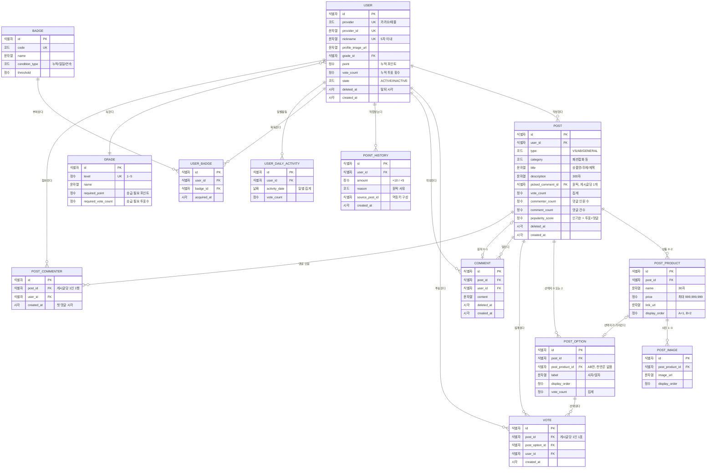
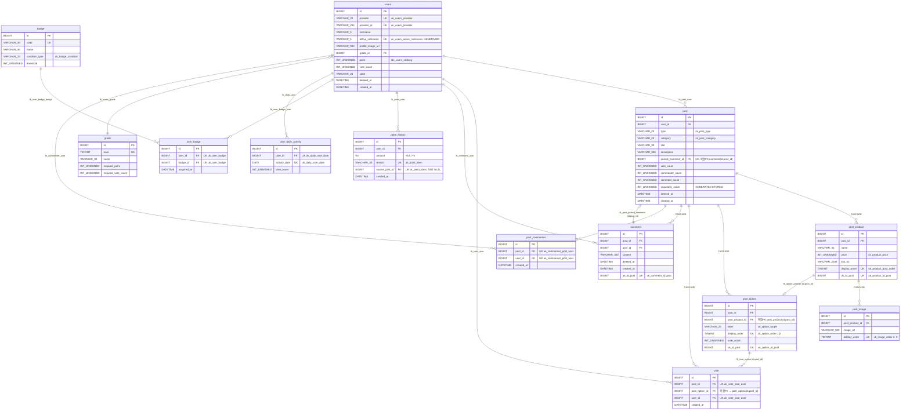

# Pickple ERD 초안

**상태**: Draft · **대상 DBMS**: MySQL 8.4 · **작성일**: 2026-08-29

> 후속 문서: [ERD 2차](./ERD-2차.md) — 화이트보드 팀 합의로 코어 범위를 좁히고 리뷰 지적을 반영한 결과다.
> 이 문서는 도출 근거로 남긴다.

찬반/A·B 투표 게시글과 댓글 원픽, 그리고 포인트·등급·뱃지 게이미피케이션을 담는
데이터 모델의 초안이다. 김영한 「실전 데이터베이스 설계」의 3단계 절차를 따라
**논리적 설계**(DBMS 비종속)와 **물리적 설계**(MySQL 8.4 최적화)를 분리해 기술한다.

---

## 1. 범위

### 1.1 근거 자료

| 자료 | 역할 |
|---|---|
| 기능 명세서 v0.1.pdf (32p) | 요구사항 정본 |
| 정책 요약표.pdf (3p) | 포인트·등급·뱃지·입력 제약 정본 |
| Figma Flow Chart (513-3120 / 3203 / 3343 / 3502) | 화면 전이와 분기 |
| Figma 화면설계서 (84-7, 262-3212) | 화면별 상세 규칙 |

Notion의 김영한 설계 1편·2편 문서는 Pickple 요구사항이 아니라 **설계 방법론 레퍼런스**로 참조했다.
공통 코드 설계, 소프트 삭제, 통계 테이블, 상속 3전략, 멱등성은 이 문서의 판단 근거로 인용한다.

### 1.2 v1 포함

회원(소셜 로그인·프로필·탈퇴) · 게시글 3유형(찬반 PICK / A·B PICK / 일반) · 상품과 사진 ·
투표 · 댓글 · 원픽(댓글 채택) · 포인트 원장 · 등급 · 뱃지 · 랭킹

### 1.3 v1 제외 — 신고 / 차단

화면설계서(262-3212) 상단에 명시돼 있다.

> 신고/차단의 기능은 모두 우선순위가 후순위입니다. 화면에 글과 모달만 존재만 합니다(**기능 X**)

화면에 버튼과 모달은 있으나 **동작하지 않는다.** 따라서 v1 스키마에 `report`·`block` 테이블을
만들지 않는다. 지금 만들면 쓰이지 않는 테이블이 남고, 실제 요구사항이 확정될 때
(신고 사유 분류, 누적 처리 정책, 차단의 가시성 범위) 구조가 바뀔 가능성이 높다.
→ [9.2 확장 지점](#92-확장-지점)에 설계 스케치만 남긴다.

### 1.4 이미 존재하는 것

이 ERD는 백지 설계가 아니다. `V1__auth_tables.sql`에 인증 테이블이 이미 있다.

```sql
CREATE TABLE users (
    id            BIGINT       NOT NULL AUTO_INCREMENT,
    provider      VARCHAR(20)  NOT NULL COMMENT 'GOOGLE | KAKAO | NAVER',
    provider_id   VARCHAR(255) NOT NULL COMMENT '프로바이더가 발급한 subject',
    ...
    UNIQUE KEY uk_users_provider (provider, provider_id)
);
```

플로우차트(513-3120)의 로그인 분기는 **"카카오/애플"** 두 가지인데,
`(provider, provider_id)` 복합 유니크가 이미 다중 프로바이더를 수용한다.
→ **새 `member` 테이블을 만들지 않는다.** `users`를 확장한다. `APPLE`을 provider 후보값에 추가한다.

기존 규약 중 이 문서가 구속받는 것:

| 출처 | 규약 |
|---|---|
| ADR-0003 | 모든 시간은 `DATETIME` **초 단위**. `TIMESTAMP`·나노초 금지 |
| ADR-0004 | 무한 스크롤은 `Window`/`ScrollPosition` — **keyset 페이지네이션** |
| ADR-0008 | 도메인/인프라 엔티티 분리 — 이 ERD는 인프라(테이블) 기준 |
| `V1` DDL 관례 | 단수형 테이블명, PK `id`, `uk_`/`fk_`/`idx_` 접두, `ENGINE=InnoDB`, `utf8mb4`, **ENUM 타입 대신 `VARCHAR` + 컬럼 COMMENT** |

---

## 2. 요구사항에서 엔티티 도출

| # | 요구사항 (출처) | 도출 엔티티 |
|---|---|---|
| 1 | 카카오/애플로 로그인한다 (Flow 513-3120) | `users` |
| 2 | 닉네임 5자 이내, 실시간 중복 검사 (정책표 §4) | `users.nickname` |
| 3 | 프로필 이미지를 설정한다. 미설정 시 랜덤 기본 (명세서 1.5) | `users.profile_image_url` |
| 4 | 탈퇴한다 (Flow 513-3502, MY_04) | `users.state`, `deleted_at` |
| 5 | 게시글은 찬반 PICK / A·B PICK / 일반 3유형 (정책표 §5) | `post.type` |
| 6 | 카테고리 6종으로 분류·필터 (정책표 §6) | `post.category` |
| 7 | 찬반은 상품 1개, A·B는 상품 2개 (정책표 §5) | `post_product` |
| 8 | 찬반 사진 1~3장, A·B 각 1장, 일반 없음 (정책표 §5) | `post_image` |
| 9 | 찬반은 사자/말자, A·B는 상품 택1 (화면설계서 COM_03) | `post_option` |
| 10 | 투표에 참여하고 투표율(%)을 본다 (화면설계서 COM_03) | `vote` |
| 11 | 댓글을 작성·수정·삭제한다 (화면설계서 COM_03) | `comment` |
| 12 | 게시글당 원픽 1개, 취소 불가, 본인 댓글 불가 (화면설계서 COM_03) | `post.picked_comment_id` |
| 13 | 원픽 시 +10P / +5P (정책표 §1) | `point_history` |
| 14 | 등급은 누적 포인트 **와** 투표 횟수로 승급 (정책표 §2) | `users.point`, `users.vote_count`, `grade` |
| 15 | 뱃지 8종 — 누적/일일/연속 투표 (정책표 §3) | `badge`, `user_badge` |
| 16 | 하루 20·30개, 7·30일 연속 투표 판정 (정책표 §3) | `user_daily_activity` |
| 17 | 인기순 = 투표 인원 수 + 댓글 인원 수 (정책표 §6) | `post.vote_count`, `post.commenter_count` |
| 18 | TOP 피커 랭킹, 동점자는 가입일 빠른 순 (명세서 3.1) | `users.point` + 인덱스 |

### 2.1 게스트에 대하여

플로우차트(513-3203)와 화면설계서에 게스트 규칙이 있다.

> 투표 4번째 진행 시도 시(**투표 3번만 가능**) '로그인이 필요해요' 모달 창 작동

**게스트는 `users` 행이 없으므로 이 3회 카운트를 담을 자리가 스키마에 없다.**
서버에 저장하려면 익명 디바이스 식별자 테이블이 필요한데, 스펙에 그런 요구가 없고
개인정보 처리 부담만 늘어난다. → **클라이언트 로컬 저장으로 가정한다.**
게스트 투표는 서버에 기록되지 않으므로 `vote` 테이블의 `user_id`는 `NOT NULL`이다.
서버 저장이 필요해지면 [9.2](#92-확장-지점) 참조.

---

## 3. 개념 모델

기술 용어(PK/FK) 없이 무엇이 있고 서로 어떻게 얽히는지만 본다.

- **회원**은 **게시글**을 쓴다. 게시글에는 유형이 있다.
- 찬반 게시글은 **상품** 하나를 놓고 살까/말까를 묻는다.
- A·B 게시글은 **상품** 둘 중 어느 쪽이냐를 묻는다.
- 일반 게시글은 상품도 투표도 없이 제목과 설명만 있다.
- 회원은 게시글의 **선택지** 하나에 **투표**한다. 한 게시글에 한 번만.
- 회원은 게시글에 **댓글**을 단다.
- 게시글 작성자는 남의 댓글 하나를 **원픽**으로 뽑는다. 게시글당 한 번, 무를 수 없다.
- 원픽이 일어나면 댓글 작성자에게 10P, 뽑은 사람에게 5P가 **적립**된다.
- 쌓인 포인트와 투표 횟수가 **등급**을 올리고, 투표 실적이 **뱃지**를 준다.

### 3.1 유형 3종을 어떻게 볼 것인가

찬반과 A·B는 겉보기에 다르지만 **둘 다 "정확히 2개 중 1개 선택"이다.**
차이는 선택지가 무엇을 가리키느냐뿐이다.

| | 상품 수 | 선택지 | 선택지가 가리키는 것 |
|---|---|---|---|
| 찬반 PICK | 1 | 사자 / 말자 | 상품 아님 (라벨) |
| A·B PICK | 2 | 상품 A / 상품 B | 상품 |
| 일반 | 0 | 없음 | — |

이 관점을 취하면 **3유형이 별도 테이블을 요구하지 않는다.**
차이가 "자식 행이 몇 개냐"로 환원되기 때문이다. 근거는 [8.1](#81-게시글-3유형--상속을-해체한다)에서 전개한다.

---

## 4. 논리적 설계

특정 DBMS에 종속되지 않는 구조다. 키와 관계, 정규화만 다룬다.
데이터 타입·인덱스·스토리지 엔진은 [5장](#5-물리적-설계--mysql-84)에서 정한다.

속성 앞의 `식별자`·`문자열`·`정수`·`코드`·`시각`·`날짜`는 **개념 수준의 종류**이지 SQL 타입이 아니다.
`BIGINT`·`VARCHAR(30)` 같은 실제 타입은 [5.2 물리 ERD](#52-물리-erd)에서 정한다.



### 4.1 정규화 판단

전부 3정규형을 만족시킨다. 다만 의도적으로 **비정규화한 컬럼 4개**가 있다.

| 컬럼 | 성격 | 근거 |
|---|---|---|
| `post.vote_count`, `post.commenter_count`, `post.comment_count` | 파생 집계 | [8.4](#84-집계-비정규화는-성능-튜닝이-아니라-정렬-키-문제다) |
| `post.popularity_score` | 생성 컬럼(두 카운터의 합) | 인기순 정렬 키. DB가 자동 유지하므로 어긋날 수 없다 |
| `post_option.vote_count` | 파생 집계 | 투표율(%) 표시 |
| `users.point` | 원장의 합계 | 랭킹 정렬 키 |
| `users.vote_count` | 파생 집계 | 등급 승급 조건 |

이들은 원본이 따로 있다(`vote`, `comment`, `point_history`). 즉 **재계산으로 복구 가능**하다.
복구 불가능한 비정규화는 하지 않았다.

---

## 5. 물리적 설계 — MySQL 8.4

논리 구조를 MySQL 8.4에 맞춘다. 핵심 질문은 **어떤 타입을 쓸 것인가**와 **어디에 인덱스를 걸 것인가**다.

운영·로컬 컨테이너 모두 `image: mysql:8.4`이므로(docker-compose-ec2.yml / -local.yml)
`CHECK` 제약과 함수 인덱스를 전제할 수 있다.

### 5.1 타입 선택 원칙

| 원칙 | 이유 |
|---|---|
| PK는 `BIGINT AUTO_INCREMENT` | InnoDB 클러스터드 인덱스. 단조 증가라 페이지 분할이 적다 |
| 시간은 전부 `DATETIME` | **ADR-0003.** `TIMESTAMP`는 세션 타임존에 따라 값이 달라진다 |
| 코드값은 `VARCHAR` + 컬럼 COMMENT | `V1`의 `provider`/`role`/`state` 관례. `ENUM`은 값 추가에 `ALTER TABLE`이 필요하다 |
| 금액은 `INT UNSIGNED` | 상한 999,999,999 < 42억. `DECIMAL`은 원화 정수에 과하다 |
| 문자셋 `utf8mb4` | 이모지 포함 가능성. `V1` 관례 |

### 5.2 물리 ERD

[4장의 논리 ERD](#4-논리적-설계)와 같은 구조를 MySQL 8.4의 어휘로 다시 그린 것이다.
논리 ERD가 "무엇이 있고 어떻게 얽히는가"를 말한다면, 이쪽은 **"어떤 타입으로 어떻게 저장하는가"**를 말한다.

| | 논리 ERD (4장) | 물리 ERD (여기) |
|---|---|---|
| 타입 | 없음 — DBMS 중립 | `BIGINT`, `VARCHAR(30)`, `DATETIME` |
| 키 | PK / FK | PK / FK / **UK** + 복합 FK |
| 추가로 보이는 것 | — | 생성 컬럼, 소유권 강제용 유니크 키 |



Mermaid `erDiagram`은 타입에 괄호를 쓸 수 없어 `VARCHAR_30` 처럼 밑줄로 적었다.
또 속성 하나에 키를 **하나만** 붙일 수 있어(`FK UK` 불가), `FK` 옆 유니크 여부는 주석에 적었다.
실제 DDL은 `VARCHAR(30)`이며 [5.3](#53-ddl)이 정본이다.

이 다이어그램에서 논리 ERD와 달라진 지점 셋이 **이종 리뷰로 반영된 것들**이다.

1. `post.popularity_score` — 생성 컬럼([8.4](#84-집계-비정규화는-성능-튜닝이-아니라-정렬-키-문제다))
2. 복합 FK 3종 — 화살표 라벨에 `(id, post_id)`로 표시([6.4](#64-복합-fk로-교차-게시글-참조를-막는다))
3. `uk_*_id_post` 3종 — 복합 FK의 대상이 되기 위한 유니크 키

### 5.3 DDL

```sql
-- =========================================================
-- V3__pickple_domain.sql
-- Pickple 도메인 — 게시글·투표·댓글·포인트·등급·뱃지
--
-- 버전은 V3부터다. V1은 인증 테이블이고 V2는 Apple 로그인(#12)이
-- 가져갔다. 실제 마이그레이션 파일로 옮길 때
-- src/main/resources/db/migration 에서 비어 있는 번호를 먼저 확인한다.
-- =========================================================

-- ---------------------------------------------------------
-- 등급 (정책표 §2)
-- 승급 조건이 "누적 200P + 투표 20회"처럼 AND 결합이라 두 컬럼을 모두 둔다.
-- ---------------------------------------------------------
CREATE TABLE grade (
    id                  BIGINT       NOT NULL AUTO_INCREMENT,
    level               TINYINT      NOT NULL COMMENT '1~5',
    name                VARCHAR(30)  NOT NULL,
    required_point      INT UNSIGNED NOT NULL DEFAULT 0,
    required_vote_count INT UNSIGNED NOT NULL DEFAULT 0,

    created_at          DATETIME     NOT NULL,
    updated_at          DATETIME     NOT NULL,

    PRIMARY KEY (id),
    UNIQUE KEY uk_grade_level (level)
) ENGINE=InnoDB DEFAULT CHARSET=utf8mb4;


-- ---------------------------------------------------------
-- 회원 확장 — 기존 users 테이블에 서비스 프로필을 추가한다.
-- 새 member 테이블을 만들지 않는 이유는 1.4 참조.
-- ---------------------------------------------------------
ALTER TABLE users
    -- 정책표 §4: 5자 이내, 한글/영문/숫자, 특수문자·이모지·공백 금지
    ADD COLUMN nickname          VARCHAR(5)   DEFAULT NULL COMMENT '5자 이내',
    ADD COLUMN profile_image_url VARCHAR(500) DEFAULT NULL COMMENT 'NULL이면 랜덤 기본 프로필',
    ADD COLUMN grade_id          BIGINT       DEFAULT NULL,

    -- 파생값이지만 저장한다 (8.4 참조)
    ADD COLUMN point             INT UNSIGNED NOT NULL DEFAULT 0 COMMENT 'point_history 합계',
    ADD COLUMN vote_count        INT UNSIGNED NOT NULL DEFAULT 0 COMMENT 'vote 건수',

    ADD COLUMN deleted_at        DATETIME     DEFAULT NULL COMMENT '탈퇴 시각. NULL이면 활성',

    -- 활성 회원만 유일. 탈퇴하면 NULL이 되어 닉네임이 풀린다.
    -- MySQL 유니크 키는 NULL을 서로 다르게 취급하므로, 탈퇴자끼리는 충돌하지 않는다.
    -- 일반 인덱스만 두면 동시 가입 두 건이 모두 통과한다 (8.5 참조).
    ADD COLUMN active_nickname   VARCHAR(5)
        GENERATED ALWAYS AS (CASE WHEN deleted_at IS NULL THEN nickname END) STORED,

    ADD CONSTRAINT fk_users_grade FOREIGN KEY (grade_id) REFERENCES grade (id),

    ADD UNIQUE KEY uk_users_active_nickname (active_nickname),

    -- TOP 피커 랭킹: 포인트 내림차순, 동점자는 가입일 빠른 순 (명세서 3.1)
    ADD KEY idx_users_ranking (point DESC, created_at);


-- ---------------------------------------------------------
-- 게시글
-- 3유형(찬반/AB/일반)을 하나의 테이블로 다룬다. 근거는 8.1.
-- ---------------------------------------------------------
CREATE TABLE post (
    id                BIGINT       NOT NULL AUTO_INCREMENT,
    user_id           BIGINT       NOT NULL,

    type              VARCHAR(20)  NOT NULL COMMENT 'VS | AB | GENERAL',
    category          VARCHAR(20)  NOT NULL COMMENT 'FASHION | ELECTRONICS | BEAUTY | LIVING | ETC',

    -- 찬반=상품명, AB=주제, 일반=제목. 셋 다 30자 제한이라 한 컬럼으로 받는다.
    title             VARCHAR(30)  NOT NULL,
    description       VARCHAR(300) DEFAULT NULL,

    -- 원픽. 게시글당 최대 1개이므로 comment 쪽 불린이 아니라 여기에 둔다 (8.2 참조).
    picked_comment_id BIGINT       DEFAULT NULL,

    -- 인기순 정렬 키 (8.4 참조)
    -- 정책표 §6은 "투표 인원 수 + 댓글 인원 수"다. 둘 다 건수가 아니라 **사람 수**다.
    vote_count        INT UNSIGNED NOT NULL DEFAULT 0 COMMENT '투표한 사람 수 (1인 1표라 건수와 같다)',
    commenter_count   INT UNSIGNED NOT NULL DEFAULT 0 COMMENT '댓글을 단 사람 수. 건수가 아니다',

    -- 화면 표시용 댓글 건수. 정렬에는 쓰지 않는다.
    comment_count     INT UNSIGNED NOT NULL DEFAULT 0 COMMENT '댓글 건수 (표시용)',

    -- 두 "인원 수"의 합. 사전식으로 정렬하면 정책과 다른 순서가 나온다 (8.4 참조).
    popularity_score  INT UNSIGNED
                      GENERATED ALWAYS AS (vote_count + commenter_count) STORED,

    deleted_at        DATETIME     DEFAULT NULL,
    created_at        DATETIME     NOT NULL,
    updated_at        DATETIME     NOT NULL,

    PRIMARY KEY (id),

    -- 하나의 댓글이 두 게시글의 원픽이 될 수 없다.
    UNIQUE KEY uk_post_picked_comment (picked_comment_id),

    CONSTRAINT fk_post_user FOREIGN KEY (user_id) REFERENCES users (id),

    -- 카테고리를 고른 경우. keyset 커서가 (정렬키, id)이므로 복합으로 건다 (5.4 참조)
    KEY idx_post_latest  (deleted_at, category, created_at DESC, id DESC),
    KEY idx_post_popular (deleted_at, category, popularity_score DESC, id DESC),

    -- 카테고리 "전체"인 경우. 위 인덱스는 category가 선행 컬럼이라
    -- 전체 조회에서 정렬에 쓰이지 못하고 filesort로 떨어진다. (5.4 참조 — 실측으로 발견)
    KEY idx_post_latest_all  (deleted_at, created_at DESC, id DESC),
    KEY idx_post_popular_all (deleted_at, popularity_score DESC, id DESC),

    -- 마이페이지 "내가 올린 투표" — 7일 이내
    KEY idx_post_user (user_id, deleted_at, created_at DESC),

    CONSTRAINT ck_post_type     CHECK (type IN ('VS', 'AB', 'GENERAL')),
    CONSTRAINT ck_post_category CHECK (category IN ('FASHION', 'ELECTRONICS', 'BEAUTY', 'LIVING', 'ETC'))
) ENGINE=InnoDB DEFAULT CHARSET=utf8mb4;


-- ---------------------------------------------------------
-- 상품 — 찬반 1개, AB 2개, 일반 0개
-- ---------------------------------------------------------
CREATE TABLE post_product (
    id            BIGINT       NOT NULL AUTO_INCREMENT,
    post_id       BIGINT       NOT NULL,

    name          VARCHAR(30)  NOT NULL COMMENT '상품명 30자',

    -- 정책표 §5: 선택 항목, 상한 999,999,999
    price         INT UNSIGNED DEFAULT NULL,
    link_url      VARCHAR(2048) DEFAULT NULL COMMENT '길이 제한 없음 → 실무 상한 2048',

    display_order TINYINT      NOT NULL DEFAULT 1 COMMENT 'A=1, B=2',

    created_at    DATETIME     NOT NULL,
    updated_at    DATETIME     NOT NULL,

    PRIMARY KEY (id),
    UNIQUE KEY uk_product_post_order (post_id, display_order),

    -- 자식(post_option)이 "같은 게시글의 상품"만 참조하도록 복합 FK의 대상이 된다. (6.4 참조)
    UNIQUE KEY uk_product_id_post (id, post_id),

    CONSTRAINT fk_product_post FOREIGN KEY (post_id) REFERENCES post (id) ON DELETE CASCADE,
    CONSTRAINT ck_product_price CHECK (price IS NULL OR price <= 999999999),
    CONSTRAINT ck_product_order CHECK (display_order IN (1, 2))
) ENGINE=InnoDB DEFAULT CHARSET=utf8mb4;


-- ---------------------------------------------------------
-- 상품 사진 — 찬반 1~3장, AB 각 1장
-- 장수 제약(1~3)은 컬럼 제약으로 표현할 수 없어 애플리케이션에서 검증한다.
-- ---------------------------------------------------------
CREATE TABLE post_image (
    id              BIGINT        NOT NULL AUTO_INCREMENT,
    post_product_id BIGINT        NOT NULL,

    image_url       VARCHAR(500)  NOT NULL,
    display_order   TINYINT       NOT NULL DEFAULT 1 COMMENT '1~3, 첫 장이 목록 썸네일',

    created_at      DATETIME      NOT NULL,

    PRIMARY KEY (id),
    UNIQUE KEY uk_image_product_order (post_product_id, display_order),

    CONSTRAINT fk_image_product FOREIGN KEY (post_product_id)
        REFERENCES post_product (id) ON DELETE CASCADE,
    CONSTRAINT ck_image_order CHECK (display_order BETWEEN 1 AND 3)
) ENGINE=InnoDB DEFAULT CHARSET=utf8mb4;


-- ---------------------------------------------------------
-- 투표 선택지 — 찬반/AB 모두 정확히 2행, 일반은 0행
-- 찬반: product_id NULL, label='사자'/'말자'
-- AB  : product_id NOT NULL, label NULL
-- ---------------------------------------------------------
CREATE TABLE post_option (
    id              BIGINT       NOT NULL AUTO_INCREMENT,
    post_id         BIGINT       NOT NULL,
    post_product_id BIGINT       DEFAULT NULL COMMENT 'AB만 사용. 찬반은 NULL',

    label           VARCHAR(20)  DEFAULT NULL COMMENT '찬반 전용: 사자 | 말자',
    display_order   TINYINT      NOT NULL COMMENT '1 | 2',

    -- 투표율(%) 표시용 집계
    vote_count      INT UNSIGNED NOT NULL DEFAULT 0,

    created_at      DATETIME     NOT NULL,

    PRIMARY KEY (id),
    UNIQUE KEY uk_option_post_order (post_id, display_order),

    -- vote가 "같은 게시글의 선택지"만 참조하도록 복합 FK의 대상이 된다. (6.4 참조)
    UNIQUE KEY uk_option_id_post (id, post_id),

    CONSTRAINT fk_option_post FOREIGN KEY (post_id) REFERENCES post (id) ON DELETE CASCADE,

    -- 단순 FK(post_product_id → post_product.id)는 "그 상품이 존재한다"만 보장하고
    -- "이 게시글의 상품이다"는 보장하지 못한다. post_id를 함께 넘겨 교차 게시글 참조를 막는다.
    CONSTRAINT fk_option_product FOREIGN KEY (post_product_id, post_id)
        REFERENCES post_product (id, post_id),

    -- 상품을 가리키거나 라벨을 갖거나, 둘 중 하나여야 한다.
    CONSTRAINT ck_option_target CHECK (
        (post_product_id IS NOT NULL AND label IS NULL) OR
        (post_product_id IS NULL     AND label IS NOT NULL)
    ),
    CONSTRAINT ck_option_order CHECK (display_order IN (1, 2))
) ENGINE=InnoDB DEFAULT CHARSET=utf8mb4;


-- ---------------------------------------------------------
-- 투표 — 게시글당 1인 1표
-- post_id를 중복 보유하는 이유는 6.2 참조.
-- ---------------------------------------------------------
CREATE TABLE vote (
    id             BIGINT   NOT NULL AUTO_INCREMENT,
    post_id        BIGINT   NOT NULL,
    post_option_id BIGINT   NOT NULL,
    user_id        BIGINT   NOT NULL COMMENT '게스트 투표는 서버에 남지 않는다 (2.1)',

    created_at     DATETIME NOT NULL,

    PRIMARY KEY (id),

    -- 한 게시글에 한 사람은 한 표. 재투표는 UPDATE로 처리한다.
    UNIQUE KEY uk_vote_post_user (post_id, user_id),

    CONSTRAINT fk_vote_post FOREIGN KEY (post_id) REFERENCES post (id) ON DELETE CASCADE,

    -- 선택지가 이 게시글의 것임을 복합 FK로 강제한다.
    -- 단순 FK였다면 post_id=1인 투표가 post_id=2의 선택지를 가리켜도 통과했다. (6.4 참조)
    CONSTRAINT fk_vote_option FOREIGN KEY (post_option_id, post_id)
        REFERENCES post_option (id, post_id),

    CONSTRAINT fk_vote_user FOREIGN KEY (user_id) REFERENCES users (id),

    -- 마이페이지 "내가 투표한 글" + 뱃지 일별/연속 판정
    KEY idx_vote_user_created (user_id, created_at)
) ENGINE=InnoDB DEFAULT CHARSET=utf8mb4;


-- ---------------------------------------------------------
-- 댓글
-- ---------------------------------------------------------
CREATE TABLE comment (
    id         BIGINT        NOT NULL AUTO_INCREMENT,
    post_id    BIGINT        NOT NULL,
    user_id    BIGINT        NOT NULL,

    content    VARCHAR(300)  NOT NULL,

    deleted_at DATETIME      DEFAULT NULL,
    created_at DATETIME      NOT NULL,
    updated_at DATETIME      NOT NULL,

    PRIMARY KEY (id),

    -- post.picked_comment_id가 "이 게시글의 댓글"만 가리키도록 복합 FK의 대상이 된다. (6.3 참조)
    UNIQUE KEY uk_comment_id_post (id, post_id),

    CONSTRAINT fk_comment_post FOREIGN KEY (post_id) REFERENCES post (id) ON DELETE CASCADE,
    CONSTRAINT fk_comment_user FOREIGN KEY (user_id) REFERENCES users (id),

    KEY idx_comment_post (post_id, deleted_at, created_at, id),
    KEY idx_comment_user (user_id, deleted_at, created_at DESC)
) ENGINE=InnoDB DEFAULT CHARSET=utf8mb4;

-- ---------------------------------------------------------
-- 게시글별 댓글 작성자 (순 인원)
--
-- 정책표 §6의 인기순은 "댓글 인원 수"다. 한 사람이 댓글을 열 번 달아도 1이다.
-- comment 를 세면 건수가 되어 혼자 순위를 올릴 수 있다 (8.4 참조).
-- 첫 댓글에서만 행이 생기고, UNIQUE 가 중복을 거부한다.
-- ---------------------------------------------------------
CREATE TABLE post_commenter (
    id         BIGINT   NOT NULL AUTO_INCREMENT,
    post_id    BIGINT   NOT NULL,
    user_id    BIGINT   NOT NULL,

    created_at DATETIME NOT NULL COMMENT '이 사람의 첫 댓글 시각',

    PRIMARY KEY (id),

    -- INSERT ... ON DUPLICATE KEY UPDATE 로 첫 댓글만 걸러낸다.
    -- 영향 행이 1이면 새 작성자이므로 post.commenter_count 를 올린다.
    UNIQUE KEY uk_commenter_post_user (post_id, user_id),

    CONSTRAINT fk_commenter_post FOREIGN KEY (post_id) REFERENCES post (id) ON DELETE CASCADE,
    CONSTRAINT fk_commenter_user FOREIGN KEY (user_id) REFERENCES users (id)
) ENGINE=InnoDB DEFAULT CHARSET=utf8mb4;


-- 원픽 FK는 comment 생성 이후에 건다 (순환 참조).
--
-- (picked_comment_id, id) → comment(id, post_id) 복합 참조다.
-- post의 자기 id를 함께 넘기므로 "그 댓글의 post_id가 나여야 한다"가 DB 차원에서 강제된다.
-- 단순 FK였다면 남의 게시글 댓글을 원픽으로 지정해도 통과했다. (6.3 참조)
ALTER TABLE post
    ADD CONSTRAINT fk_post_picked_comment
        FOREIGN KEY (picked_comment_id, id) REFERENCES comment (id, post_id);


-- ---------------------------------------------------------
-- 원픽 불가역성 (R-06)
--
-- UNIQUE는 "몇 개인가"만 말하고 "바꿔도 되는가"는 말하지 못한다.
-- 한 행의 값을 바꾸는 것은 유일성을 깨지 않으므로
-- UPDATE post SET picked_comment_id = <다른 댓글> 이 그대로 통과한다.
-- 불가역성은 상태 전이 규칙이라 컬럼 제약으로 표현할 수 없다. (8.2 참조)
-- ---------------------------------------------------------
DELIMITER $$
CREATE TRIGGER trg_post_pick_immutable
BEFORE UPDATE ON post FOR EACH ROW
BEGIN
    IF OLD.picked_comment_id IS NOT NULL
       AND (NEW.picked_comment_id IS NULL
            OR NEW.picked_comment_id <> OLD.picked_comment_id) THEN
        SIGNAL SQLSTATE '45000'
            SET MESSAGE_TEXT = '원픽은 취소하거나 변경할 수 없다 (R-06)';
    END IF;
END$$
DELIMITER ;


-- ---------------------------------------------------------
-- 포인트 원장 (정책표 §1)
-- 잔액만 두지 않는 이유와 멱등키 설계는 8.3 참조.
-- ---------------------------------------------------------
CREATE TABLE point_history (
    id             BIGINT       NOT NULL AUTO_INCREMENT,
    user_id        BIGINT       NOT NULL,

    amount         INT          NOT NULL COMMENT '+10 | +5. 회수 대비 부호 있는 정수',
    reason         VARCHAR(30)  NOT NULL COMMENT 'PICKED(내 댓글이 원픽됨) | PICKING(내가 픽함)',

    -- NOT NULL 이어야 멱등키가 성립한다.
    -- nullable 이면 MySQL 유니크 키가 NULL 을 서로 다르게 취급해 중복 적립이 뚫린다 (8.3 참조).
    source_post_id BIGINT       NOT NULL COMMENT '멱등키 구성 요소. 어느 게시글의 원픽인가',

    created_at     DATETIME     NOT NULL,

    PRIMARY KEY (id),

    -- 원픽은 게시글당 1회이고 취소가 불가능하다.
    -- 따라서 (게시글, 회원, 사유)가 유일하면 중복 지급이 구조적으로 막힌다.
    UNIQUE KEY uk_point_idem (source_post_id, user_id, reason),

    CONSTRAINT fk_point_user FOREIGN KEY (user_id) REFERENCES users (id),

    -- 존재하지 않는 게시글을 출처로 적는 것을 막는다.
    CONSTRAINT fk_point_post FOREIGN KEY (source_post_id) REFERENCES post (id),

    CONSTRAINT ck_point_reason CHECK (reason IN ('PICKED', 'PICKING')),

    KEY idx_point_user_created (user_id, created_at DESC)
) ENGINE=InnoDB DEFAULT CHARSET=utf8mb4;


-- ---------------------------------------------------------
-- 뱃지 (정책표 §3)
-- ---------------------------------------------------------
CREATE TABLE badge (
    id             BIGINT       NOT NULL AUTO_INCREMENT,
    code           VARCHAR(40)  NOT NULL,
    name           VARCHAR(30)  NOT NULL COMMENT '뱃지명은 추후 수정 예정',

    condition_type VARCHAR(20)  NOT NULL COMMENT 'TOTAL_VOTE | DAILY_VOTE | STREAK_VOTE',
    threshold      INT UNSIGNED NOT NULL COMMENT '10/100/500/1000 | 20/30 | 7/30',

    created_at     DATETIME     NOT NULL,
    updated_at     DATETIME     NOT NULL,

    PRIMARY KEY (id),
    UNIQUE KEY uk_badge_code (code),
    CONSTRAINT ck_badge_condition CHECK (condition_type IN ('TOTAL_VOTE', 'DAILY_VOTE', 'STREAK_VOTE'))
) ENGINE=InnoDB DEFAULT CHARSET=utf8mb4;


CREATE TABLE user_badge (
    id          BIGINT   NOT NULL AUTO_INCREMENT,
    user_id     BIGINT   NOT NULL,
    badge_id    BIGINT   NOT NULL,

    acquired_at DATETIME NOT NULL,

    PRIMARY KEY (id),

    -- 같은 뱃지를 두 번 획득하지 않는다.
    UNIQUE KEY uk_user_badge (user_id, badge_id),

    CONSTRAINT fk_user_badge_user  FOREIGN KEY (user_id)  REFERENCES users (id),
    CONSTRAINT fk_user_badge_badge FOREIGN KEY (badge_id) REFERENCES badge (id)
) ENGINE=InnoDB DEFAULT CHARSET=utf8mb4;


-- ---------------------------------------------------------
-- 일별 활동 집계
-- "하루 20개", "7일 연속" 판정을 vote 전체 스캔 없이 하기 위한 통계 테이블.
-- 근거는 8.6 참조.
-- ---------------------------------------------------------
CREATE TABLE user_daily_activity (
    id            BIGINT       NOT NULL AUTO_INCREMENT,
    user_id       BIGINT       NOT NULL,
    activity_date DATE         NOT NULL,

    vote_count    INT UNSIGNED NOT NULL DEFAULT 0,

    created_at    DATETIME     NOT NULL,
    updated_at    DATETIME     NOT NULL,

    PRIMARY KEY (id),

    -- UPSERT 대상. 투표마다 INSERT ... ON DUPLICATE KEY UPDATE 로 누적한다.
    UNIQUE KEY uk_daily_user_date (user_id, activity_date),

    CONSTRAINT fk_daily_user FOREIGN KEY (user_id) REFERENCES users (id)
) ENGINE=InnoDB DEFAULT CHARSET=utf8mb4;
```

### 5.4 인덱스 설계 근거

무한 스크롤이 **keyset**이라는 점(ADR-0004)이 인덱스 모양을 결정한다.
`OFFSET` 방식이면 정렬 컬럼 하나로 충분하지만, keyset은 커서 비교 조건이

```sql
WHERE (created_at, id) < (:cursorCreatedAt, :cursorId)
```

형태라 **정렬 키와 타이브레이커가 같은 인덱스에 연속으로 들어가야** 인덱스만으로 커서를 찾는다.

| 인덱스 | 대상 쿼리 | 컬럼 순서 이유 |
|---|---|---|
| `idx_post_latest` | 카테고리 선택 + 최신순 | `deleted_at`·`category`로 먼저 좁히고(등가 조건), 그 안에서 `created_at DESC, id DESC` 범위 스캔 |
| `idx_post_popular` | 카테고리 선택 + 인기순 | 같은 이유. 정렬 키는 생성 컬럼 `popularity_score` 하나다 |
| `idx_post_latest_all` | **카테고리 전체** + 최신순 | 아래 참조 |
| `idx_post_popular_all` | **카테고리 전체** + 인기순 | 아래 참조 |
| `idx_users_ranking` | TOP 피커 | `point DESC, created_at` — 동점자 가입일 순(명세서 3.1)이 인덱스 순서와 일치 |
| `idx_vote_user_created` | 뱃지 판정, 내 활동 | `user_id` 등가 + `created_at` 범위 |

**등가 조건 컬럼을 앞에, 범위/정렬 컬럼을 뒤에** 두는 원칙을 따랐다.

`created_at`에 `DATETIME` 초 단위를 쓰므로 같은 초에 여러 글이 들어오면 동률이 생긴다.
그래서 모든 keyset 인덱스에 **`id`를 타이브레이커로 넣었다.** ADR-0003이 기록한
"3건 중 2건만 조회되는" 사고가 정확히 이 동률 처리 누락에서 나왔다.

#### "전체" 카테고리를 위한 인덱스가 따로 필요하다 — 실측으로 발견

처음에는 `idx_post_latest`·`idx_post_popular` 둘이면 충분하다고 봤다.
`post` 10만 행을 넣고 `EXPLAIN`으로 확인하니 **틀렸다.**

정책표 §6의 기본 필터는 **"전체(기본값)"**다. 즉 `category` 조건이 없는 조회가 가장 흔하다.
그런데 두 인덱스는 `category`가 선행 컬럼이라, 조건에서 빠지면
정렬 컬럼이 인덱스의 연속된 뒷부분이 되지 못한다. 그 결과:

```
Extra: Using index condition; Using filesort     ← 약 5만 행을 정렬
```

`category`를 뺀 인덱스를 추가하자 filesort가 사라졌다.

| 쿼리 | 인덱스 추가 전 | 추가 후 |
|---|---|---|
| 전체 카테고리 인기순 1페이지 (10만 행 중 LIMIT 10) | **10,485 ~ 14,165μs** | **242 ~ 281μs** |
| 실행 계획 | `idx_post_latest` + filesort | `idx_post_popular_all`, filesort 없음 |

같은 조건 3회 반복 측정값이다. 약 12ms에서 0.26ms로 줄었다.

이 사례가 남기는 교훈은 **선행 컬럼이 선택적(optional) 필터면 인덱스를 둘로 나눠야 한다**는 것이다.
"카테고리로 좁히면 빨라지겠지"라는 직관이 **가장 흔한 경로인 전체 조회를 가장 느리게** 만들었다.

대가는 인덱스 4개의 쓰기 비용과 저장 공간이다. 게시글은 읽기가 쓰기보다 압도적으로 많은
데이터라 감수할 만하다고 판단했다.

---

## 6. 연관관계 상세

### 6.1 카디널리티와 삭제 정책

| 관계 | 카디널리티 | ON DELETE | 이유 |
|---|---|---|---|
| `post` → `users` | N:1 | 제약 없음(RESTRICT) | 회원은 소프트 삭제한다. 물리 삭제가 없으므로 CASCADE가 불필요하다 |
| `post_product` → `post` | N:1 | **CASCADE** | 상품은 게시글에 종속된 부품이다. 홀로 존재할 이유가 없다 |
| `post_image` → `post_product` | N:1 | **CASCADE** | 같은 이유 |
| `post_option` → `post` | N:1 | **CASCADE** | 같은 이유 |
| `vote` → `post` | N:1 | **CASCADE** | 게시글이 사라지면 그 투표는 의미를 잃는다 |
| `vote` → `users` | N:1 | RESTRICT | 투표 이력은 뱃지·등급의 근거다. 지우면 안 된다 |
| `comment` → `post` | N:1 | **CASCADE** | |
| `post` → `comment` (원픽) | 1:0..1 | RESTRICT | 아래 6.3 |
| `point_history` → `users` | N:1 | RESTRICT | **원장은 지우지 않는다** |

게시글은 소프트 삭제(`deleted_at`)가 기본이므로 CASCADE는 실제로는 거의 발동하지 않는다.
운영 중 물리 삭제(스팸 정리 등)가 필요할 때의 안전망이다.

### 6.2 `vote`가 `post_id`를 중복으로 갖는 이유

`vote.post_option_id`만 있어도 `post_option`을 거쳐 `post_id`를 알 수 있다.
정규화 관점에서는 `post_id`가 이행적 종속으로 보인다. 그럼에도 두는 이유는

> **"한 게시글에 한 사람은 한 표"를 스키마로 강제해야 하기 때문이다.**

`UNIQUE (post_id, user_id)`가 없으면 같은 사람이 선택지 1과 선택지 2에 각각 한 표씩 넣는 것을
DB가 막지 못한다. 애플리케이션 검증만으로는 동시 요청에서 뚫린다.
`post_id`를 갖는 대가로 **중복 투표가 구조적으로 불가능해진다.** 이 교환은 남는 장사다.

정합성은 `post_option.post_id = vote.post_id`가 항상 참이어야 한다는 조건으로 유지되며,
투표 저장 시 선택지의 소속 게시글을 확인하는 것으로 보장한다.

### 6.3 원픽 관계 — `post`와 `comment`의 순환

`post.picked_comment_id → comment.id`이고 `comment.post_id → post.id`다. 순환 참조다.
DDL에서는 `comment` 생성 후 `ALTER TABLE`로 FK를 추가해 해소한다.

이 방향을 택한 근거는 [8.2](#82-원픽은-댓글의-속성이-아니라-게시글의-속성이다)에 있다.

참조는 단순 FK가 아니라 **복합 FK**다.

```sql
FOREIGN KEY (picked_comment_id, id) REFERENCES comment (id, post_id)
```

`post`가 **자기 `id`를 함께 넘긴다.** 그래야 "그 댓글의 `post_id`가 나여야 한다"가 성립한다.
단순 FK였다면 남의 게시글 댓글을 원픽으로 지정해도 통과했다([6.4](#64-복합-fk로-교차-게시글-참조를-막는다)).

### 6.4 복합 FK로 교차 게시글 참조를 막는다

FK는 **"그 행이 존재한다"**만 보장한다. **"그 행이 이 게시글의 것이다"**는 보장하지 않는다.
이 간극으로 세 곳이 뚫려 있었다.

| 뚫린 곳 | 단순 FK로는 | 결과 |
|---|---|---|
| `post_option.post_product_id` | 상품이 존재하면 OK | 게시글 A의 선택지가 게시글 B의 상품을 가리킴 |
| `vote.post_option_id` | 선택지가 존재하면 OK | 게시글 A에 투표하며 게시글 B의 선택지를 고름 |
| `post.picked_comment_id` | 댓글이 존재하면 OK | 남의 게시글 댓글을 원픽 |

셋 다 FK·UNIQUE·CHECK를 **전부 만족시키면서** 성립한다. 제약이 "관계"를 보지 않기 때문이다.

해법은 **자식에 `post_id`를 함께 넘기는 복합 FK**다.
이를 위해 부모 쪽에 `UNIQUE (id, post_id)`를 둔다 — FK 대상은 유니크 인덱스여야 하기 때문이다.

```sql
-- 부모: 복합 FK의 대상이 되기 위한 유니크 키
UNIQUE KEY uk_product_id_post (id, post_id)   -- post_product
UNIQUE KEY uk_option_id_post  (id, post_id)   -- post_option
UNIQUE KEY uk_comment_id_post (id, post_id)   -- comment

-- 자식: post_id 를 함께 넘겨 소유권을 강제
FOREIGN KEY (post_product_id, post_id) REFERENCES post_product (id, post_id)
FOREIGN KEY (post_option_id,  post_id) REFERENCES post_option  (id, post_id)
FOREIGN KEY (picked_comment_id, id)    REFERENCES comment      (id, post_id)
```

`(id, post_id)`는 `id`가 이미 PK라 **논리적으로 중복된 유니크 키**다.
그럼에도 두는 이유는 **복합 FK의 대상이 되려면 그 컬럼 조합에 유니크 인덱스가 필요**하기 때문이다.
저장 비용은 인덱스 하나이고, 얻는 것은 **애플리케이션 버그가 만들 수 없는 데이터**다.

이 방식의 한계도 분명하다. **선택지가 정확히 2개**(또는 일반 게시글은 0개)라는 개수 제약은
여전히 스키마로 표현할 수 없다. 행 개수를 세는 제약은 `CHECK`의 범위 밖이다.
게시글 발행 시점에 응용 계층이 검증하며, 이는 [9.1](#91-확인이-필요한-것)에 미결로 남긴다.

---

## 7. 필드 사전

주요 컬럼 중 이름만으로 뜻이 분명하지 않은 것만 적는다.

### `users` (확장분)

| 컬럼 | 설명 |
|---|---|
| `nickname` | 5자 이내. 한글/영문/숫자만. 특수문자·이모지·공백 금지(정책표 §4). 형식 검증은 애플리케이션 |
| `profile_image_url` | `NULL`이면 랜덤 기본 프로필을 부여한다(명세서 1.5). 기본 이미지를 DB에 박지 않는다 |
| `point` | `point_history`의 합계를 캐싱한 값 |
| `vote_count` | `vote` 건수를 캐싱한 값. 등급 승급이 포인트와 **AND** 조건이라 필요 |
| `deleted_at` | 탈퇴 시각. `NULL`이면 활성. `state`와 중복으로 보이지만 `state`는 상태, 이쪽은 시점을 남긴다 |

### `post`

| 컬럼 | 설명 |
|---|---|
| `type` | `VS`(찬반) / `AB` / `GENERAL`(일반) |
| `title` | 유형별로 의미가 다르다. 찬반=상품명, A·B=주제, 일반=제목. 셋 다 30자라 한 컬럼으로 받는다 |
| `picked_comment_id` | 원픽된 댓글. `NULL`이면 아직 없음. 한번 채워지면 **바뀌지 않는다**(취소 불가) |
| `vote_count` | 투표한 **사람 수**. 1인 1표라 건수와 같다 |
| `commenter_count` | 댓글을 단 **사람 수**. 원본은 `post_commenter` |
| `comment_count` | 댓글 **건수**. 화면 표시용이며 정렬에 쓰지 않는다 |
| `popularity_score` | **생성 컬럼**(`vote_count + commenter_count`). 인기순 정렬 키. 정책표 §6은 **인원 수의 합**이라 건수를 쓰거나 두 컬럼으로 정렬하면 안 된다([8.4](#84-집계-비정규화는-성능-튜닝이-아니라-정렬-키-문제다)) |

### `post_option`

| 컬럼 | 설명 |
|---|---|
| `post_product_id` | A·B 유형에서만 채운다. 찬반은 `NULL` |
| `label` | 찬반에서만 채운다(`사자`/`말자`). A·B는 `NULL` |
| `display_order` | 1 또는 2. 화면 노출 순서이자 A/B 구분 |

### `point_history`

| 컬럼 | 설명 |
|---|---|
| `amount` | `+10`(내 댓글이 원픽됨) 또는 `+5`(내가 픽함). 부호 있는 `INT`라 향후 회수도 표현 가능 |
| `reason` | `PICKED` / `PICKING`. 한 번의 원픽이 **두 사람에게 각각** 적립되므로 사유로 구분한다 |
| `source_post_id` | 멱등키 구성. 어느 게시글의 원픽에서 나온 포인트인지 |

---

## 8. 설계 결정과 트레이드오프

### 8.1 게시글 3유형 — 상속을 해체한다

김영한 2편이 제시하는 상속 3전략을 놓고 비교했다.

| 전략 | 이 도메인에 적용하면 | 판정 |
|---|---|---|
| 단일 테이블 | `post`에 `product_a_name`, `product_b_price`... 를 전부 펼침 | 일반 게시글은 대부분 `NULL`. 찬반 사진 1~3장을 컬럼으로 못 편다 |
| 조인 전략 | `post` + `vs_post` + `ab_post` + `general_post` | 조회마다 유형 분기 조인. 유형이 늘면 테이블도 늘어난다 |
| 구현 클래스별 | 유형마다 독립 테이블 | 목록 조회(전체 유형 혼합 + 인기순 정렬)가 `UNION`이 된다. **정렬·페이징이 무너진다** |

셋 다 마땅치 않은 이유는 **문제를 잘못 잡았기 때문이다.** 유형별로 다른 것은 게시글 자체가 아니라
**딸린 상품 수와 선택지 구성**이다. 그래서 그 둘을 자식 테이블로 빼면 상속 문제가 사라진다.

```
찬반 : post 1 + post_product 1 + post_image 1~3 + post_option 2(라벨형)
A·B  : post 1 + post_product 2 + post_image 각 1 + post_option 2(상품참조형)
일반 : post 1 + post_product 0 + post_image 0   + post_option 0
```

**얻은 것**: 목록 조회가 `post` 단일 테이블 스캔 + 인덱스 정렬로 끝난다.
유형이 늘어도(예: 3지선다) 스키마 변경 없이 `post_option` 행 수만 달라진다.
`vote` 테이블이 유형과 무관하게 하나다.

**치른 대가**: 상세 조회에서 상품·사진·선택지 3개 테이블을 조인한다.
목록에 썸네일을 띄우려면 첫 사진을 가져오는 조인이 추가된다.

**대안을 버리지 않은 이유**: 목록 성능이 실제로 문제가 되면
`post.thumbnail_url` 반정규화 컬럼을 추가하는 것이 다음 수순이다.
지금 넣지 않는 것은 **측정 전이기 때문**이다. 구조는 그 변경을 받아들일 수 있게 열려 있다.

### 8.2 원픽은 댓글의 속성이 아니라 게시글의 속성이다

화면설계서 COM_03의 규칙 셋:

> - 본인의 댓글에는 원픽 불가
> - 타인의 댓글에는 원픽 가능 (**한 게시글에 하나의 원픽만 가능**)
> - **원픽 이후 취소 불가**

흔한 설계는 `comment.is_picked BOOLEAN`이다. **이 모델은 틀렸다.**
불린으로는 "한 게시글에 원픽 2개"를 막을 수 없기 때문이다.
막으려면 "같은 `post_id`를 가진 댓글 중 `is_picked = true`인 것은 최대 1개"라는
조건부 유니크가 필요한데, **MySQL은 부분 인덱스(partial index)를 지원하지 않는다.**

그래서 게시글 쪽에 둔다.

```sql
picked_comment_id BIGINT DEFAULT NULL,
UNIQUE KEY uk_post_picked_comment (picked_comment_id)
```

`post` 한 행에 컬럼이 하나이므로 **게시글당 원픽 1개가 자료구조상 자명해진다.**
`UNIQUE`는 덤으로 "한 댓글이 두 게시글의 원픽이 되는" 이상 상태까지 막는다
(정상 경로에서는 발생할 수 없지만, 잘못된 UPDATE를 DB가 거부한다).

#### `UNIQUE`가 막지 못하는 것 — 실측으로 발견

위 구조를 MySQL 8.4에 올려 위반을 주입해 보니 **`UNIQUE`만으로는 규칙의 절반만 지켜졌다.**

| 시도 | 기대 | 실제 |
|---|---|---|
| 다른 게시글이 이미 원픽된 댓글을 가져가기 | 거부 | ✅ 거부 (`uk_post_picked_comment`) |
| 이미 원픽이 있는 게시글에서 **다른 댓글로 변경** | 거부 | ❌ **통과** |
| 이미 원픽이 있는 게시글에서 **원픽 취소**(`NULL`) | 거부 | ❌ **통과** |

원인은 단순하다. **`UNIQUE`는 "몇 개인가"를 말하지 "바꿔도 되는가"를 말하지 않는다.**
한 행의 값을 다른 값으로 바꾸는 것은 유일성을 조금도 위반하지 않는다.

즉 R-05(게시글당 1개)는 컬럼 제약으로 표현되지만
**R-06(취소·변경 불가)은 상태 전이 규칙이라 컬럼 제약으로 표현될 수 없다.**
둘을 한 제약이 함께 지켜 줄 것이라 넘겨짚은 것이 처음의 오류였다.

그래서 `BEFORE UPDATE` 트리거로 전이를 막는다([5.3](#53-ddl) 끝부분).
`NULL → 값`(최초 지정)만 허용하고 `값 → 다른 값`과 `값 → NULL`을 거부한다.

이 방식의 대가는 **비즈니스 규칙이 애플리케이션과 DB 두 곳에 있게 된다**는 점이다.
그럼에도 DB에 두는 이유는 원픽이 **포인트 지급의 방아쇠**이기 때문이다([8.3](#83-포인트는-원장으로-쌓는다)).
애플리케이션 버그나 운영 중 수동 `UPDATE`로 원픽이 바뀌면 이미 지급된 포인트와 어긋난다.
되돌리기 어려운 데이터일수록 마지막 방어선을 DB에 둔다.

#### 스키마가 지킬 수 없는 것

"본인 댓글 불가"(R-07)는 `post.user_id != comment.user_id` 비교라 두 테이블에 걸쳐 있다.
`CHECK`는 다른 테이블을 참조할 수 없으므로 **애플리케이션 검증 + 트랜잭션**으로 처리한다.
트리거로도 가능하지만 조회가 섞여 비용이 커지고, 이쪽은 잘못돼도
포인트처럼 되돌리기 어려운 결과를 낳지 않아 응용 계층에 맡긴다.

이건 스키마의 한계이며, 문서에 남겨 두는 것이 정직하다.

### 8.3 포인트는 원장으로 쌓는다

정책표 §1은 한 번의 원픽이 **두 사람에게** 포인트를 준다고 말한다.

| 발생 조건 | 지급 |
|---|---|
| 내 댓글이 원픽으로 선정됨 | +10P |
| 내가 댓글을 픽할 때 | +5P |

`users.point`만 두고 `UPDATE ... SET point = point + 10`을 하면
**얼마가 왜 들어왔는지 알 수 없고, 중복 지급을 되돌릴 수 없다.**
그래서 `point_history`를 원장으로 두고 `users.point`는 그 합계의 캐시로 둔다.

멱등성은 이 도메인에서 유난히 쉽게 풀린다. **원픽이 게시글당 1회이고 취소가 불가능하기 때문이다.**

```sql
UNIQUE KEY uk_point_idem (source_post_id, user_id, reason)
```

같은 게시글의 원픽으로 같은 사람에게 같은 사유의 포인트를 두 번 넣으려 하면
DB가 거부한다. 동시에 두 번 클릭해도 한쪽이 중복 키로 실패한다.
**낙관적 락도 보상 트랜잭션도 필요 없다.** 취소 가능한 설계였다면 이야기가 완전히 달라졌을 것이다.

#### 멱등키가 `NULL`을 허용하면 멱등하지 않다 — 이종 리뷰로 발견

위 문단은 초안에서 **사실이 아니었다.** `source_post_id`를 `DEFAULT NULL`로 두었기 때문이다.

MySQL 유니크 키는 **`NULL`을 서로 다른 값으로 취급한다.**
따라서 `source_post_id`가 `NULL`인 행은 같은 `(user_id, reason)` 조합이어도 몇 번이든 들어간다.
재시도나 잘못된 쓰기가 **되돌릴 수 없는 포인트를 반복 지급**할 수 있었다.

```sql
-- 아래 두 INSERT 가 모두 성공한다 (NULL != NULL)
INSERT INTO point_history (user_id, amount, reason, source_post_id, ...) VALUES (2,10,'PICKED',NULL,...);
INSERT INTO point_history (user_id, amount, reason, source_post_id, ...) VALUES (2,10,'PICKED',NULL,...);
```

FK도 없어 **존재하지 않는 게시글 ID**를 출처로 적어도 통과했다.

그래서 `source_post_id`를 **`NOT NULL` + `post(id)` FK**로 바꿨다.
현재 정의된 두 사유(`PICKED`·`PICKING`)는 모두 게시글에서 비롯되므로 출처가 없을 수 없다.
게시글과 무관한 적립 사유가 생기면 **그 사유의 멱등키를 따로 설계**하고,
이 제약을 느슨하게 만들지 않는다.

**이 결함을 1차 검증이 놓친 이유**는 `source_post_id=1`처럼 값이 있는 경우만 주입했기 때문이다.
같은 문서 8.5에서 "`NULL`은 유니크 검사에서 서로 다르게 취급된다"며 B안을 기각해 놓고,
바로 옆 테이블에서 같은 함정을 밟았다. **경계값(`NULL`)을 주입 대상에 넣지 않은 것**이 원인이다.

### 8.4 집계 비정규화는 성능 튜닝이 아니라 정렬 키 문제다

`post.vote_count`·`commenter_count`·`comment_count`는 파생값이라 원칙적으로 두면 안 된다.
그럼에도 두는 이유는 추측성 최적화가 아니라 **구조적 귀결**이다.

정책표 §6의 인기순 정의는

> 인기순 = 투표 인원 수 + 댓글 인원 수

이 값이 컬럼으로 없으면 정렬은 이렇게 된다.

```sql
ORDER BY (SELECT COUNT(*) FROM vote WHERE post_id = p.id)
       + (SELECT COUNT(*) FROM comment WHERE post_id = p.id) DESC
```

**정렬 키가 계산식이면 인덱스로 정렬할 수 없다.** 후보 전체를 읽어 계산한 뒤 filesort해야 하고,
무한 스크롤이라 이 짓을 페이지마다 반복한다. 게다가 keyset 커서를 만들 안정적인 키가 없다.
즉 컬럼이 없으면 **요구된 기능 자체가 성립하지 않는다.**

#### 두 카운터로 정렬하면 정책과 다른 순서가 나온다 — 이종 리뷰로 발견

처음에는 인덱스를 `(vote_count DESC, comment_count DESC)`로 잡았다. **이것이 틀렸다.**

정책은 두 값의 **합**을 말하는데 저 인덱스는 **사전식**으로 정렬한다. 결과가 실제로 갈린다.

| 게시글 | 투표 | 댓글 | 정책상 점수 | 사전식 순위 |
|---|---|---|---|---|
| A | 10 | 0 | 10 | **1위** |
| B | 9 | 100 | **109** | 2위 |

정책대로면 B가 위여야 하는데 사전식은 A를 위로 올린다.
요구사항을 스키마로 옮기는 과정에서 **연산자가 바뀐** 셈이다.

그래서 합을 **생성 컬럼**으로 저장하고 그 하나로 정렬한다.

```sql
popularity_score INT UNSIGNED
    GENERATED ALWAYS AS (vote_count + commenter_count) STORED
```

(이 시점에는 `comment_count`를 더했다. 그것이 남은 오류였고 바로 아래에서 다시 고친다.)

`STORED`라 인덱스를 걸 수 있고, 두 카운터가 바뀌면 MySQL이 **자동으로** 다시 계산한다.
애플리케이션이 합을 따로 갱신하지 않으므로 **어긋날 여지 자체가 없다.**
(`VIRTUAL`은 저장하지 않아 인덱스 갱신 시점이 달라지고, 여기서는 이점이 없다.)

정렬은 `ORDER BY popularity_score DESC, id DESC` 하나로 끝난다.

#### "인원 수"는 건수가 아니다 — 같은 문장을 두 번 잘못 읽었다

합으로 고친 뒤에도 여전히 틀린 곳이 남아 있었다. 정책표 §6을 다시 보면

> 인기순 = 투표 **인원 수** + 댓글 **인원 수**

둘 다 **사람 수**다. 그런데 `comment_count`(댓글 건수)를 더하고 있었다.
투표는 `uk_vote_post_user` 덕분에 1인 1표라 건수와 인원이 같지만,
**댓글은 한 사람이 몇 개든 달 수 있다.** 혼자 댓글 열 개를 달면 점수가 10 올라간다.
사용자가 **순위를 마음대로 올릴 수 있는** 구멍이다.

그래서 순 인원을 따로 센다.

```sql
commenter_count INT UNSIGNED NOT NULL DEFAULT 0   -- 댓글을 단 사람 수
comment_count   INT UNSIGNED NOT NULL DEFAULT 0   -- 댓글 건수 (표시용)

popularity_score GENERATED ALWAYS AS (vote_count + commenter_count) STORED
```

두 값을 **분리해서 둔다.** 화면은 "댓글 12개"를 보여줘야 하므로 건수도 필요하고,
정렬은 인원 수를 써야 하기 때문이다. 하나로 합치면 둘 중 하나가 틀린다.

유지는 `post_commenter(post_id, user_id)` 관계 테이블로 한다.

```sql
INSERT INTO post_commenter (post_id, user_id, created_at)
VALUES (:postId, :userId, :now)
ON DUPLICATE KEY UPDATE id = id;   -- 이미 있으면 아무것도 하지 않는다

-- 영향 행이 1이면 이 사람의 첫 댓글이다
UPDATE post SET commenter_count = commenter_count + 1 WHERE id = :postId;
```

`UNIQUE (post_id, user_id)`가 **DB 차원에서 중복을 거부**하므로,
동시에 같은 사람의 첫 댓글 두 건이 들어와도 한쪽만 카운터를 올린다.
애플리케이션에서 `SELECT`로 먼저 확인하는 방식은 이 경합에서 뚫린다.

관계 테이블을 두는 대가는 행 하나와 인덱스 하나다.
얻는 것은 **언제든 재계산 가능한 원본**이다 — 카운터가 어긋나면
`SELECT COUNT(*) FROM post_commenter WHERE post_id = ?`로 복구한다.

**같은 한 줄을 두 번 잘못 읽었다.** 1차에서는 "합이냐 사전식이냐"만 고치고
"인원 수"라는 단어는 그대로 지나쳤다. 요구사항 문구는 연산자뿐 아니라
**세는 단위까지** 대조해야 한다는 것이 이 사례의 교훈이다.

#### 무한 스크롤 중 순위가 변한다는 문제는 남는다

`popularity_score`는 투표와 댓글이 들어올 때마다 바뀐다.
사용자가 스크롤하는 동안 순위가 움직이면 **커서 경계를 넘나드는 행이 생겨**
같은 글이 두 번 보이거나(중복) 아예 안 보일 수 있다(누락).

이건 인덱스로 풀리는 문제가 아니라 **페이지네이션 일관성 모델의 선택**이다.

| 안 | 방법 | 대가 |
|---|---|---|
| A | 최선 노력(best-effort). 중복·누락을 허용하고 클라이언트가 중복 제거 | 드물게 글이 빠질 수 있다 |
| B | 스냅샷 — 첫 페이지 요청 시각을 커서에 싣고 그 시점 기준으로 조회 | 오래된 순위를 보게 된다 |
| C | 랭킹 에포크 — 주기적으로 순위를 고정해 스크롤 중에는 불변 | 배치와 저장 비용 |

**A를 채택한다.** 투표 게시판의 인기순은 실시간성이 자연스럽고,
글 하나가 어쩌다 밀리는 것이 사용자에게 실질적 손해가 아니기 때문이다.
다만 **이건 의도된 선택이지 미처리가 아니라는 점**을 여기 남긴다.
정확성이 요구되면 B로 옮긴다(커서에 `as_of` 시각을 더하면 되고 스키마 변경은 없다).

#### 대가

`vote` INSERT와 `post.vote_count` UPDATE가 **같은 트랜잭션**에 있어야 하고,
동시 투표 시 해당 `post` 행에 락이 걸려 인기 게시글에서 경합이 생긴다.
이 경합이 실제 문제가 되는지는 **측정 후에** 판단한다(대안: 카운터 분산, 주기적 재계산).
쓰기 프로토콜은 [8.8](#88-투표-쓰기-트랜잭션-프로토콜)에 정리했다.

원본이 남아 있으므로 어긋나면 재계산으로 복구할 수 있다는 점이 이 결정의 안전장치다.

### 8.5 소프트 삭제와 닉네임 유일성의 충돌

탈퇴가 있고(Flow 513-3502), 닉네임은 실시간 중복 검사 대상이다(정책표 §4).
`nickname`에 `UNIQUE`를 걸면 **탈퇴한 회원이 닉네임을 영구히 점유한다.**
5자 제한이라 이름 공간이 좁아 실제로 문제가 된다.

선택지를 놓고 보면

| 안 | 방법 | 평가 |
|---|---|---|
| A | `UNIQUE (nickname)` | 탈퇴자가 점유. 부적절 |
| B | `UNIQUE (nickname, deleted_at)` | `NULL`은 유니크 검사에서 서로 다르게 취급돼 **활성 회원 중복을 못 막는다.** 오답 |
| C | 탈퇴 시 닉네임을 `NULL`로 비움 + 일반 인덱스 | **유니크 제약이 없어 동시 가입 두 건이 모두 통과한다.** 오답 |
| D | 생성 컬럼 + 유니크 인덱스 | `CASE WHEN deleted_at IS NULL THEN nickname END`로 활성 회원만 유일 |

**D를 채택한다.**

```sql
active_nickname VARCHAR(5)
    GENERATED ALWAYS AS (CASE WHEN deleted_at IS NULL THEN nickname END) STORED,
UNIQUE KEY uk_users_active_nickname (active_nickname)
```

활성 회원은 `nickname` 값이 그대로 들어가 유일성이 강제되고,
탈퇴하면 `NULL`이 되어 **닉네임이 즉시 풀린다.**
MySQL 유니크 키는 `NULL`을 서로 다르게 취급하므로 탈퇴자끼리는 충돌하지 않는다.
B안을 무너뜨린 바로 그 `NULL` 성질이 여기서는 정확히 필요한 동작이 된다.

#### 처음에 C를 골랐던 것이 오류였다 — 이종 리뷰로 발견

초안은 C를 채택하고 "D는 인덱스 정의가 복잡해 팀 이해 비용이 올라간다"고 적었다.
**정합성을 가독성과 맞바꾼 잘못된 판단이었다.**

C에는 유니크 제약이 아예 없다. 그래서 동시에 두 사람이 같은 닉네임으로 가입하면
둘 다 애플리케이션의 중복 검사를 통과하고 커밋된다.

```
T1: SELECT ... WHERE nickname='가나다'  → 없음
T2: SELECT ... WHERE nickname='가나다'  → 없음   (T1 커밋 전)
T1: INSERT → 성공
T2: INSERT → 성공                                ← 활성 회원 둘이 같은 닉네임
```

게다가 **사후 복구가 어렵다.** 이미 두 계정 모두 활성이라 어느 쪽을 바꿔야 할지 정할 근거가 없다.

"탈퇴자 점유 문제"를 푸는 데 집중하다가 **본래 목적인 중복 방지를 잃어버린 것**이 원인이다.
정책표 §4의 "실시간 중복 검사"는 **입력 단계 피드백**을 말하며,
DB 제약을 대신하지 못한다. 애플리케이션 검사는 조기 피드백용으로만 남긴다.

**주의**: MySQL 8.0+의 기본 콜레이션 `utf8mb4_0900_ai_ci`는 **대소문자와 악센트를 무시한다.**
따라서 `Pick`과 `pick`은 **같은 닉네임으로 취급된다.** 이것이 의도인지 확인이 필요하다
([9.1](#91-확인이-필요한-것) 참조). 구분하려면 `utf8mb4_0900_as_cs`를 컬럼에 지정해야 한다.

### 8.6 뱃지 판정과 일별 집계 테이블

정책표 §3의 뱃지 8종은 조건 유형이 셋이다.

| 유형 | 조건 | 판정에 필요한 것 |
|---|---|---|
| 누적 투표 | 10 / 100 / 500 / 1,000회 | `users.vote_count` 하나로 충분 |
| 일일 투표량 | 하루 20 / 30개 | **날짜별 투표 수** |
| 연속 참여 | 7 / 30일 연속 | **날짜별 투표 유무의 연속성** |

뒤의 둘을 `vote` 테이블에서 직접 구하면 회원의 전체 투표 이력을 날짜로 묶어야 한다.
투표가 쌓일수록 비용이 선형으로 증가하고, 이 판정은 **투표할 때마다** 일어난다.

그래서 `user_daily_activity`를 둔다. 김영한 2편의 "통계 테이블" 절이 다루는 상황과 같다.

```sql
INSERT INTO user_daily_activity (user_id, activity_date, vote_count, ...)
VALUES (:userId, CURRENT_DATE, 1, ...)
ON DUPLICATE KEY UPDATE vote_count = vote_count + 1;
```

`UNIQUE (user_id, activity_date)` 덕분에 **UPSERT 한 방으로 멱등하게** 누적된다.
"하루 20개"는 오늘 행의 `vote_count` 조회로 끝나고, "7일 연속"은 최근 7행 조회로 끝난다.

### 8.7 코드값을 어떻게 저장할 것인가

`post.type`, `post.category`, `point_history.reason` 등은 후보값이 정해진 코드성 데이터다.
김영한 2편은 이런 데이터를 문자열로 하드코딩할 때의 문제를 다루며 공통 코드 테이블을 제시한다.

이 프로젝트는 **`VARCHAR` + 컬럼 COMMENT + `CHECK` 제약**을 택한다. 이유는

1. `V1__auth_tables.sql`이 이미 `provider`·`role`·`state`를 이 방식으로 쓴다. **일관성이 우선이다.**
2. 카테고리 6종·유형 3종은 **화면에 하드코딩된 고정 목록**이다. 운영 중 추가되지 않는다.
   공통 코드 테이블의 이점(값 추가에 배포 불필요)이 발생하지 않는다.
3. `ENUM` 타입은 값 추가에 `ALTER TABLE`이 필요하고 정렬 순서가 선언 순서라 함정이 있다.
4. `CHECK` 제약이 MySQL 8.4에서 실제로 동작하므로 오타는 DB가 막는다.

카테고리가 운영자 관리 대상이 되면 공통 코드 테이블로 옮긴다.

### 8.8 투표 쓰기 트랜잭션 프로토콜

투표 한 번이 건드리는 행이 넷이다. 순서를 정해 두지 않으면 **데드락이 난다.**

| 대상 | 연산 |
|---|---|
| `vote` | INSERT (재투표면 UPDATE) |
| `post_option.vote_count` | 선택지 카운터 ±1 |
| `post.vote_count` | 게시글 카운터 +1 (재투표는 변화 없음) |
| `user_daily_activity` | 날짜별 UPSERT |
| `users.vote_count` | 누적 +1 (재투표는 변화 없음) |

#### 락 순서를 하나로 고정한다

동시에 두 트랜잭션이 서로 다른 순서로 같은 행들을 잠그면 데드락이 난다.
**모든 투표 경로가 아래 순서를 지킨다.**

```
1. vote            (INSERT/UPDATE — uk_vote_post_user 가 직렬화 지점)
2. post_option     (선택지 카운터)
3. post            (게시글 카운터)
4. users           (누적 카운터)
5. user_daily_activity (UPSERT)
```

게시글 → 선택지가 아니라 **선택지 → 게시글 순**인 점이 중요하다.
재투표는 선택지 두 개를 건드리는데(이전 -1, 새것 +1),
이때 **`id` 오름차순으로** 잠가야 서로 반대 방향으로 도는 트랜잭션이 생기지 않는다.

#### 재투표 의미

`uk_vote_post_user (post_id, user_id)`가 있으므로 재투표는 INSERT가 아니라 UPDATE다.

- `post.vote_count`는 **변하지 않는다** (사람 수는 그대로)
- `post_option.vote_count`는 **둘이 바뀐다** (이전 선택지 -1, 새 선택지 +1)
- `users.vote_count`와 `user_daily_activity`도 **변하지 않는다** (같은 사람의 같은 투표)

이 구분을 놓치면 재투표할 때마다 투표 수가 부풀고 뱃지가 잘못 나간다.

#### `UNSIGNED` 카운터를 감산할 때의 함정 — 실측으로 발견

카운터를 전부 `INT UNSIGNED`로 잡았는데, 재투표의 "이전 선택지 -1"에서 문제가 드러났다.
값이 0인 상태에서 감산하면 MySQL이 오류를 내고 **트랜잭션 전체가 실패한다.**

```
ERROR 1690 (22003): BIGINT UNSIGNED value is out of range in
                    '(`post_option`.`vote_count` - 1)'
```

정상 흐름에서는 0이 될 수 없지만, 카운터가 한 번 어긋나면
**그 선택지에 대한 모든 재투표가 영구히 막힌다.** 조용한 오차가 기능 정지로 번지는 셈이다.

그래서 감산은 **하한을 걸어** 수행한다.

```sql
UPDATE post_option
   SET vote_count = GREATEST(vote_count, 1) - 1
 WHERE id = :previousOptionId;
```

`WHERE vote_count > 0` 조건으로 거르는 방법도 있으나, 그 경우 **갱신이 조용히 0건**이 되어
오차가 그대로 남는다. `GREATEST`는 최소한 0으로 수렴시킨다.
어느 쪽이든 근본 해결은 아니며, 어긋난 값은 `vote` 원본에서 재계산해 바로잡는다.

`INT UNSIGNED`를 `INT`로 바꿔 음수를 허용하는 선택지도 있으나 채택하지 않았다.
음수 투표 수는 도메인상 의미가 없고, 오류로 드러나는 편이 조용히 음수로 남는 것보다 낫다.

#### 데드락 재시도

락 순서를 고정해도 InnoDB 갭 락이나 인덱스 경합으로 데드락(`ER_LOCK_DEADLOCK`)이 날 수 있다.
**트랜잭션 전체를 최대 3회 재시도**하고, 그 이상이면 사용자에게 실패를 알린다.

재시도가 안전한 이유는 `uk_vote_post_user` 때문이다.
중복 INSERT는 유니크 키에서 거부되므로 **재시도가 표를 두 번 넣지 않는다.**
카운터도 트랜잭션 단위로 롤백되므로 부분 적용이 남지 않는다.

#### 댓글 쓰기도 같은 규율을 따른다

댓글은 투표보다 단순하지만 **순 인원 카운터** 때문에 순서가 필요하다.

```
1. comment          (INSERT)
2. post_commenter   (INSERT ... ON DUPLICATE KEY UPDATE — 첫 댓글 판별)
3. post             (comment_count +1, 첫 댓글이면 commenter_count 도 +1)
```

`post_commenter`의 `UNIQUE (post_id, user_id)`가 **판별과 직렬화를 동시에** 맡는다.
영향 행이 1이면 새 작성자이므로 `commenter_count`를 올리고, 0이면 올리지 않는다.

애플리케이션에서 `SELECT`로 기존 댓글 여부를 먼저 확인하는 방식은
**동시 첫 댓글 두 건이 모두 "없음"을 보고 각각 +1** 하는 경합에 뚫린다.
판별을 DB 제약에 맡기는 이유가 이것이다.

댓글 삭제는 `comment_count`만 줄이고 **`commenter_count`와 `post_commenter`는 건드리지 않는다.**
남은 댓글이 있는지 확인해야 정확한데, 그 비용이 크고
"댓글을 단 적 있는 사람"이라는 사실 자체는 삭제로 뒤집히지 않는다고 봤다.
정확한 값이 필요하면 `post_commenter`와 활성 `comment`를 대조해 재계산한다.

#### 경합 한계는 아직 측정하지 않았다

인기 게시글 하나에 투표가 몰리면 `post` 행 하나에 락이 집중된다.
**이 구조가 몇 TPS까지 버티는지 측정하지 않았다.** 추측으로 최적화하지 않기 위해 지금은 두고,
실제 부하 시나리오에서 임계치를 잡은 뒤 필요하면 아래 순서로 완화한다.

1. `post.vote_count`를 동기 경로에서 빼고 비동기 집계로 옮긴다
2. 그래도 부족하면 카운터를 N개로 쪼개 분산 후 합산한다

**두 안 모두 스키마 변경 없이 가능하다** — `vote`가 원본으로 남아 있어 언제든 재계산할 수 있기 때문이다.

---

## 9. 가정과 미결

### 9.1 확인이 필요한 것

| # | 항목 | 현재 가정 | 확인 포인트 |
|---|---|---|---|
| 1 | 게스트 투표 3회 | **클라이언트 로컬 저장** | 앱 재설치·기기 변경 시 초기화돼도 되는가 |
| 2 | 닉네임 대소문자 | 콜레이션 기본값(`ai_ci`)이라 `Pick` = `pick` | 구분해야 하면 `as_cs` 지정 필요 |
| 3 | "원픽 횟수" | **댓글 작성자가 누적으로 받은 원픽 수** | 게시글당 원픽이 1개뿐이라 "댓글당 횟수"는 0/1이 되어 무의미. 해석이 맞는지 |
| 4 | 재투표 | `vote` UPDATE로 선택지 변경 | 변경 이력을 남겨야 하는가 |
| 5 | 등급 | 저장(반정규화) + 승급 시 갱신 | 강등이 있는가 (포인트 회수 시) |
| 6 | 일반 게시글 | 투표·상품·사진 없음 | 정렬의 "인기순"에서 투표수 0으로 항상 밀리는데 의도인가 |
| 7 | 탈퇴 상태 | **미정** — 이 초안은 `deleted_at`, #12 구현은 `users.state` | 어느 쪽을 정본으로 삼는가. 아래 참고 |

7번은 이 초안과 #12를 겹쳐야 보이는 문제라 따로 적어둔다.
[8.5](#85-소프트-삭제와-닉네임-유일성의-충돌)에서 채택한 D안은 `active_nickname` 생성 컬럼이 `deleted_at`만
참조하는데, #12의 `User.withdraw()`는 `state`만 `INACTIVE`로 바꾼다. 두 모델을 그대로 합치면
탈퇴해도 `deleted_at`이 NULL로 남아 **닉네임이 반납되지 않는다.** 닉네임이 5자 제한이라
이름공간이 좁은 만큼 체감이 크다.

정본을 하나로 정해야 한다. `deleted_at`을 남기면 D안은 그대로 살릴 수 있지만
`withdraw()`·`UserEntity` 매핑·DDL 세 곳을 함께 고쳐야 하고, `state` 하나로 통일하면
생성 컬럼 조건만 `state = 'ACTIVE'`로 바꾸면 되지만 탈퇴 시각을 잃는다.
탈퇴 시각이 정책상 필요한지에 달렸다 — #11에서 논의 중이며, 정해지면 이 문서에 반영한다.

### 9.2 확장 지점

**신고 / 차단** — v1 제외([1.3](#13-v1-제외--신고--차단)). 도입 시 스케치:

```
report (id, reporter_id, target_type, target_id, reason, status, created_at)
block  (id, blocker_id, blocked_user_id, created_at)  -- UNIQUE(blocker_id, blocked_user_id)
```
`target_type`으로 게시글/댓글/회원을 함께 받는 다형 참조는 FK를 걸 수 없다는 대가가 있다.
대상별 테이블 분리와 비교해 결정해야 한다.

**게스트 투표 서버 저장** — 필요해지면 `guest_vote(device_id, post_id, ...)`.
개인정보 처리방침에 디바이스 식별자 수집을 명시해야 한다.

**목록 썸네일** — 측정 후 필요하면 `post.thumbnail_url` 반정규화([8.1](#81-게시글-3유형--상속을-해체한다)).

### 9.3 이 초안의 검증 상태

**DDL 적용**: `mysql:8.4.11` 컨테이너에 `V1__auth_tables.sql` → 본 DDL 순으로 실제 적용해
13개 테이블 생성을 확인했다. 문법 통과는 대리지표이므로 **위반을 주입해** 제약이 실제로
거부하는지 확인했다.

| # | 주입한 위반 | 관련 규칙 | 결과 |
|---|---|---|---|
| 1 | 같은 사람이 같은 게시글에 2표 | R-09 | ✅ 거부 (`uk_vote_post_user`) |
| 2 | 다른 게시글이 이미 원픽된 댓글을 가져감 | R-05 | ✅ 거부 (`uk_post_picked_comment`) |
| 3 | 이미 원픽이 있는데 다른 댓글로 변경 | R-06 | ❌ → 트리거 추가 후 ✅ 거부 |
| 4 | 이미 원픽이 있는데 취소(`NULL`) | R-06 | ❌ → 트리거 추가 후 ✅ 거부 |
| 5 | 최초 원픽 지정(`NULL` → 값) | R-06 | ✅ 허용 (막히면 안 됨) |
| 6 | 같은 원픽으로 같은 사람에게 중복 적립 | R-13 | ✅ 거부 (`uk_point_idem`) |
| 7 | 같은 뱃지 2회 획득 | R-17 | ✅ 거부 (`uk_user_badge`) |
| 8 | 정의되지 않은 게시글 유형(`POLL`) | 8.7 | ✅ 거부 (`ck_post_type`) |
| 9 | 가격 999,999,999 초과 | 5.2 | ✅ 거부 (`ck_product_price`) |
| 10 | 사진 4장째(`display_order=4`) | R-03 | ✅ 거부 (`ck_image_order`) |
| 11 | 선택지가 상품과 라벨을 둘 다 가짐 | R-04 | ✅ 거부 (`ck_option_target`) |
| 12 | 선택지가 상품도 라벨도 없음 | R-04 | ✅ 거부 (`ck_option_target`) |

**2차 검증 — 이종 리뷰 지적 반영 후** (`mysql:8.4`, 새 컨테이너에 처음부터 재적용):

| # | 주입한 위반 | 관련 규칙 | 결과 |
|---|---|---|---|
| 13 | 선택지가 **남의 게시글 상품**을 참조 | 소유권 | ✅ 거부 (`fk_option_product` 복합 FK) |
| 14 | 투표가 **남의 게시글 선택지**를 참조 | R-10 | ✅ 거부 (`fk_vote_option` 복합 FK) |
| 15 | 원픽이 **남의 게시글 댓글**을 지정(최초 지정) | R-05 | ✅ 거부 (`fk_post_picked_comment` 복합 FK) |
| 16 | 정상 투표 / 정상 원픽 | — | ✅ 통과 (막히면 안 됨) |
| 17 | 인기순 정렬: 10표0댓글 vs 9표100댓글 | 정책표 §6 | ✅ **9표100댓글이 상위** (109 > 10) |
| 18 | 카운터 변경 시 `popularity_score` 자동 갱신 | — | ✅ 10 → 15 자동 반영 |
| 19 | `popularity_score` 직접 UPDATE 시도 | — | ✅ 거부 (생성 컬럼) |
| 20 | 재투표 시 `post.vote_count` 증가 여부 | 8.8 | ✅ 불변(0 유지), 선택지 카운터만 이동 |
| 21 | `UNSIGNED` 카운터 0에서 감산 | 8.8 | ❌ → `GREATEST` 적용 후 ✅ |

**15번이 이종 리뷰의 수확이다.** 1차 검증에서 트리거가 R-06(변경·취소 금지)을 막는 것만 확인하고,
**최초 지정 시 그 댓글이 이 게시글 것인지는 한 번도 확인하지 않았다.**
`UNIQUE`도 트리거도 교차 행 소유권은 보지 못한다. 복합 FK로 닫았다.

**17번은 요구사항 오독이었다.** 정책표 §6은 "투표 인원 수 **+** 댓글 인원 수"인데
인덱스를 `(vote_count, comment_count)` 사전식으로 잡아 **정책과 다른 순서**가 나왔다.
1차 검증이 이를 못 잡은 이유는 제약만 시험하고 **정렬 결과를 한 번도 대조하지 않았기** 때문이다.

**21번은 2차 검증 자체가 새로 잡은 것이다.** 재투표의 "이전 선택지 -1"이
`UNSIGNED` 언더플로로 트랜잭션을 통째로 실패시켰다.

**3차 검증 — 2차 이종 리뷰 지적 반영 후** (`mysql:8.4`, 새 컨테이너에 처음부터 재적용):

| # | 주입한 위반 | 관련 규칙 | 결과 |
|---|---|---|---|
| 22 | 활성 회원과 **같은 닉네임으로 신규 가입** | 정책표 §4 | ✅ 거부 (`uk_users_active_nickname`) |
| 23 | 탈퇴 후 그 닉네임을 다른 사람이 사용 | 8.5 | ✅ 허용 (막히면 안 됨) |
| 24 | 탈퇴자 2명이 같은 닉네임 보유 | 8.5 | ✅ 허용 (`NULL`끼리 충돌 없음) |
| 25 | `source_post_id`를 **`NULL`로** 포인트 적립 | R-13 | ✅ 거부 (`NOT NULL`) |
| 26 | **존재하지 않는 게시글**을 출처로 적립 | R-13 | ✅ 거부 (`fk_point_post`) |
| 27 | 한 사람이 **댓글 3개**를 단 뒤 인기 점수 | 정책표 §6 | ✅ `commenter_count=1`, 점수 1 (건수 3과 분리) |
| 28 | 다른 사람이 댓글을 달면 인원 증가 | 정책표 §6 | ✅ `commenter_count=2`, 점수 2 |
| 29 | `commenter_count`를 원본과 대조 | 8.4 | ✅ 저장값 2 = `post_commenter` 2행 |
| 30 | `active_nickname` 직접 UPDATE | — | ✅ 거부 (생성 컬럼) |
| 31 | 기존 제약 8건 회귀 확인 | R-04·05·09·10 등 | ✅ 전부 거부 유지 |
| 32 | 트리거 R-06 회귀 확인 | R-06 | ✅ 최초 지정 허용, 취소 거부 |

**22·25·27번이 2차 이종 리뷰의 수확이다.** 셋 다 **내가 "검증 완료"라고 적은 영역**에서 나왔다.

- **22번**: 8.5에서 C안(일반 인덱스)을 고르며 **유일성 자체를 잃었다.**
  "탈퇴자 점유"를 푸는 데 몰두하다 본래 목적인 중복 방지를 놓쳤다.
- **25번**: 8.3이 "DB가 거부한다"고 **단언했으나 사실이 아니었다.**
  `NULL` 경계값을 주입 대상에 넣지 않아 1·2차 검증 모두 통과했다.
- **27번**: 정책표 §6의 "**인원 수**"를 건수로 읽었다. 1차에서 같은 문장의
  연산자(합/사전식)만 고치고 **세는 단위는 두 번 다 놓쳤다.**

세 건의 공통 원인은 **주입 케이스를 내가 예상한 실패 경로로만 구성한 것**이다.
경계값(`NULL`)·동시성·요구사항 문구 정밀 대조가 빠져 있었다.

**3·4번이 이 검증의 수확이다.** 설계 시점에는 `UNIQUE` 하나가 R-05와 R-06을 함께
지켜 줄 것이라 여겼으나, 실제로 돌려 보니 R-06은 뚫려 있었다([8.2](#82-원픽은-댓글의-속성이-아니라-게시글의-속성이다)).
읽어서는 발견되지 않았을 결함이다.

**한글 저장**: `nickname VARCHAR(5)`에 3자 한글이 정상 저장됨을 확인했다.
(검증 중 `Data too long` 오류가 났으나 원인은 스키마가 아니라 클라이언트의
`character_set_client=latin1`이었다. 애플리케이션 JDBC URL에 이미
`characterEncoding=UTF-8`이 설정돼 있어 실제 경로에는 영향이 없다.)

| 항목 | 상태 |
|---|---|
| DDL 문법·제약 동작 | ✅ MySQL 8.4.11에서 **32건** 위반 주입으로 검증 |
| 교차 게시글 소유권 | ✅ 복합 FK 3종으로 차단 확인 (13~15번) |
| 인기순 정렬 의미 | ✅ 합 연산(17번) + **인원 수 단위**(27~29번) 확인 |
| 닉네임 유일성 | ✅ 활성 중복 거부, 탈퇴 후 해제 (22~24번) |
| 포인트 멱등성 | ✅ `NULL` 경계·잘못된 FK 포함 (25~26번) |
| 인덱스 실효성 | ✅ 10만 행 `EXPLAIN` — filesort 제거, 12ms → 0.26ms |
| 요구사항 커버리지 | ✅ 기능명세서 32p + 정책 요약표 3p + 플로우차트 4종 대조 |
| 이종 리뷰 | ✅ Codex 적대적 리뷰 **2회**, high 6건 전부 반영 |
| 화면설계서 | ⚠️ **2/4장만 대조** — 온보딩(94-475), 마이페이지(97-750) 미확인 |
| 동시성 부하 한계 | ❌ **미측정** — 인기 게시글 락 경합 임계치 ([8.8](#88-투표-쓰기-트랜잭션-프로토콜)) |
| 동시 쓰기 경합 실측 | ❌ **미측정** — 닉네임·첫 댓글 동시 삽입은 제약으로 막히는 것만 확인, 실제 병렬 부하는 미실시 |

**동시성은 프로토콜만 정하고 한계는 재지 않았다.** [8.8](#88-투표-쓰기-트랜잭션-프로토콜)의
락 순서·재시도·재투표 의미는 정의했고 재투표 동작은 확인했으나(20·21번),
**인기 게시글 하나에 투표가 몰릴 때 몇 TPS까지 버티는지는 측정하지 않았다.**
추측으로 카운터를 분산하지 않고, 부하 시나리오가 생기면 그때 측정해 판단한다.

---

## 10. 참고

- ADR-0003 — 시간은 `LocalDateTime`, `DATETIME` 초 단위
- ADR-0004 — 무한 스크롤은 `Window`/`ScrollPosition` (keyset)
- ADR-0008 — 도메인/인프라 엔티티 분리
- `V1__auth_tables.sql` — `users`, `user_refresh_token`
- 김영한 「실전 데이터베이스 설계」 1편 — 개념·논리·물리 3단계
- 김영한 「실전 데이터베이스 설계」 2편 — 공통 코드, 소프트 삭제, 통계 테이블, 상속 3전략, 멱등성
