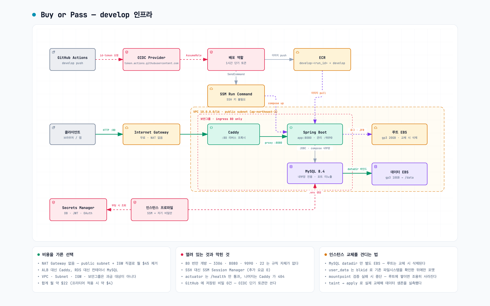

# develop 인프라 (Terraform)

단일 EC2 위에 docker-compose 로 앱과 MySQL 을 띄운다. 월 약 $22.5.
설계 근거는 [ADR-0012](../docs/adr/0012-develop-infra-single-ec2.md) ·
[ADR-0013](../docs/adr/0013-oidc-and-secrets-manager.md) ·
[ADR-0022](../docs/adr/0022-route53-and-caddy-tls.md), 완료 판정은
[PRD-007](../docs/prd/PRD-007-develop배포인프라.md) ·
[PRD-008](../docs/prd/PRD-008-develop도메인연결과자동배포.md) 에 있다.



NAT Gateway·ALB·RDS·VPC Endpoint·ACM 을 **쓰지 않는다.** 이것이 비용 구조의 전부다.
도메인은 Route53 hosted zone(월 $0.50), TLS 는 EC2 위 Caddy 가 Let's Encrypt 로 종단한다.

<sub>다크 버전: [`develop-infra.dark.png`](../docs/diagrams/develop-infra.dark.png) ·
뷰별로 따라가려면 [인터랙티브 구조도](../docs/diagrams/develop-infra.html)</sub>

## 사전 준비

```bash
aws sts get-caller-identity --profile root_habin   # 251128835262 여야 한다
```

state 버킷은 닭-달걀 문제라 Terraform 밖에서 1회 만든다.
**버저닝은 필수다** — 워크로드와 같은 계정에 있어 계정이 오염되면 state 도 함께 잃는다.

```bash
BUCKET=buyorpass-tfstate-251128835262
REGION=ap-northeast-2

aws s3api create-bucket --bucket "$BUCKET" --region "$REGION" \
  --create-bucket-configuration LocationConstraint="$REGION" --profile root_habin

aws s3api put-bucket-versioning --bucket "$BUCKET" \
  --versioning-configuration Status=Enabled --profile root_habin

aws s3api put-public-access-block --bucket "$BUCKET" --profile root_habin \
  --public-access-block-configuration \
  BlockPublicAcls=true,IgnorePublicAcls=true,BlockPublicPolicy=true,RestrictPublicBuckets=true

aws s3api put-bucket-encryption --bucket "$BUCKET" --profile root_habin \
  --server-side-encryption-configuration \
  '{"Rules":[{"ApplyServerSideEncryptionByDefault":{"SSEAlgorithm":"AES256"}}]}'
```

로컬 도구: `terraform` 1.10+, `aws`, `jq`, `openssl` (비밀 동기화 스크립트가 쓴다).

## 적용

```bash
terraform init
terraform plan     # 아래 "비용 사전 검증"을 먼저 돌린다
terraform apply
terraform output next_steps
```

### 비용 사전 검증 (PRD-007 판정 1)

과금 리소스가 계획에 섞이지 않았는지 확인한다. **빈 출력이어야 한다.**
Route53 zone 은 유일하게 과금되는 추가 항목($0.50/월)이며 의도된 것이라 패턴에 넣지 않는다.

```bash
terraform plan -no-color | grep -E "nat_gateway|_lb\.|db_instance|vpc_endpoint|cloudfront|acm_certificate"
```

## apply 직후

순서가 있다. HTTP-01 인증서는 DNS 가 EIP 를 가리켜야 나오고, 자동 배포는 GitHub 변수가
있어야 열린다. `terraform output next_steps` 가 실값을 채워 같은 순서로 출력한다.

### 1) 비밀 동기화

자리표시자(`CHANGE_ME`) 상태로는 앱이 뜨지 않는다. `fetch-secrets.sh` 가 먼저 막는다.

로컬 `.env` 를 읽어 Secrets Manager 에 넣는 스크립트가 있다. **키 스키마의 정본은 `.env.example`
이다**(ADR-0026) — 키 선언 직전의 주석 블록에 `@secret` 마커를 달면 스크립트와 `locals.tf` 가
그대로 따라온다. **목록을 다른 곳에 또 적지 않는다.**

```bash
terraform/scripts/sync-secrets.sh --check     # 아무것도 쓰지 않고 스키마 정합만 본다
terraform/scripts/sync-secrets.sh --dry-run   # 키 · 출처 · 길이 표만 본다. 값은 찍지 않는다
terraform/scripts/sync-secrets.sh
```

키마다 값은 이 순서로 정해진다: `.env` 값(자리표시자 `change-me*` 제외) → 원격에 이미 있는 값 →
`@generate=N` 이 달린 키는 생성 → `@default=V` 또는 `not-configured`. `@remote-wins` 가 달린
MySQL 패스워드는 원격을 먼저 보므로, 재실행해도 이미 초기화된 MySQL 패스워드는 바뀌지 않는다.

#### 새 비밀을 추가할 때

`.env.example` **한 곳만** 고친다.

```
# 새 키에 대한 설명
# @secret @generate=32
NEW_SECRET_KEY=
```

| 마커 | 뜻 |
|---|---|
| `@secret` | Secrets Manager 에 올린다. **없으면 로컬 전용이라 올라가지 않는다** |
| `@generate=N` | 값이 없을 때 `openssl rand -base64 N` 으로 생성 |
| `@remote-wins` | 원격 값이 로컬 `.env` 보다 우선(초기화된 MySQL 보호) |
| `@default=V` | 최종 폴백. 기본은 `not-configured` |

주의할 점 두 가지.

- **마커와 키 선언 사이에 빈 줄을 두지 않는다.** 빈 줄이 블록을 끊어 그 키는 로컬 전용이 된다
  (안전한 방향으로 실패한다). `--check` 가 마커 개수와 파싱된 키 개수를 대조해 잡는다.
- **같은 키를 두 번 선언하지 않는다.** 첫 선언의 정책만 적용되어 `@remote-wins` 같은 보호가
  조용히 사라진다. 이것도 `--check` 가 잡는다.

`--check` 는 이 다섯 가지를 본다 — `terraform output` 과의 스키마 일치, 마커 유실, 중복 선언,
로컬 전용 키(`SPRING_PROFILES_ACTIVE` 등)에 `@secret` 이 붙었는지, compose 가 쓰는 변수의 공급 여부.
- **컨테이너에 전달하려면 `docker-compose-ec2.yml` 의 `environment:` 에도 추가해야 한다**(ADR-0017).
  이건 최소권한 경계라 자동화하지 않는다. 빠뜨리면 아래 검사가 배포를 멈춘다.

#### 동기화를 잊으면 배포가 멈춘다

`fetch-secrets.sh` 가 기동할 때마다 기대 키 집합과 원격을 대조해, 빠진 키가 있으면 **배포를
실패시킨다**(ADR-0026). 값은 찍지 않고 빠진 키 이름만 알린다.

```
FATAL: Secrets Manager 에 다음 키가 없습니다: oauth_apple_private_key_base64
  로컬에서 terraform/scripts/sync-secrets.sh 를 실행한 뒤 다시 배포하십시오.
```

이 검사가 없던 시절 Apple 7키가 스키마에만 추가되고 동기화되지 않아, compose 의 `:-` 기본값이
조용히 메꾸면서 **Apple 로그인이 약 4일간 꺼진 채 운영됐다.** 헬스체크는 계속 초록이었다.

스크립트 없이 손으로 넣을 때:

```bash
aws secretsmanager put-secret-value \
  --secret-id "$(terraform output -raw secret_arn)" \
  --region ap-northeast-2 --profile root_habin \
  --secret-string "{
    \"mysql_root_password\": \"$(openssl rand -base64 24)\",
    \"mysql_password\": \"$(openssl rand -base64 24)\",
    \"jwt_secret_key\": \"$(openssl rand -base64 48)\",
    \"oauth_google_client_id\": \"not-configured\",
    \"oauth_google_client_secret\": \"not-configured\",
    \"oauth_kakao_client_id\": \"not-configured\",
    \"oauth_kakao_client_secret\": \"not-configured\",
    \"oauth_naver_client_id\": \"not-configured\",
    \"oauth_naver_client_secret\": \"not-configured\",
    \"oauth_apple_enabled\": \"false\",
    \"oauth_apple_team_id\": \"not-configured\",
    \"oauth_apple_key_id\": \"not-configured\",
    \"oauth_apple_client_id\": \"not-configured\",
    \"oauth_apple_private_key_base64\": \"not-configured\",
    \"oauth_apple_token_encryption_keys\": \"not-configured\",
    \"oauth_apple_token_active_key_id\": \"not-configured\"
  }"
```

⚠️ OAuth 값을 **빈 문자열로 두지 않는다.** compose 의 `${VAR:-기본값}` 은 변수가
"미설정"일 때만 발동하므로, 빈 값이 있으면 그대로 전달돼 Spring 이
`Client id must not be empty` 로 기동을 거부한다. 안 쓰는 프로바이더는 `not-configured` 로 둔다.

#### Apple provider token 암호화 키는 지금 생성 가능

이 값은 Apple에서 받는 키가 아니다. `.p8`, `jwt_secret_key`와 별도로 32바이트를 생성한다.
값은 화면·채팅·Git에 남기지 말고 Secrets Manager에 바로 저장한다.

```bash
APPLE_TOKEN_AES_KEY="$(openssl rand -base64 32 | tr -d '\n')"
# Secret JSON에는 oauth_apple_token_encryption_keys = "k1=$APPLE_TOKEN_AES_KEY",
# oauth_apple_token_active_key_id = "k1" 형태로 병합한다.
```

PowerShell은 [Apple 로그인 Runbook](../docs/apple-sign-in-runbook.md)의 생성 명령을 사용한다.

#### Apple 키를 받은 뒤

`AuthKey_XXXX.p8` PEM 원문은 개행 때문에 `.env`를 깨뜨린다. 파일 전체를 한 줄 Base64로 바꿔
`oauth_apple_private_key_base64`에 저장한다. PowerShell에서는 다음처럼 값만 만든다.

```powershell
[Convert]::ToBase64String([IO.File]::ReadAllBytes('AuthKey_XXXX.p8'))
```

기존 Secret JSON을 먼저 내려받고 **MySQL/JWT/다른 OAuth 값을 모두 보존한 채** 다음 Apple 필드를
병합한다. `put-secret-value`는 일부 필드 수정이 아니라 JSON 전체 교체다.

```text
oauth_apple_enabled=true
oauth_apple_team_id=<Team ID>
oauth_apple_key_id=<Key ID>
oauth_apple_client_id=<iOS Bundle ID>
oauth_apple_private_key_base64=<위에서 만든 한 줄 값>
oauth_apple_token_encryption_keys=k1=<별도로 생성한 32바이트 AES 키의 Base64>
oauth_apple_token_active_key_id=k1
```

Apple `client_secret`은 Secrets Manager에 저장하지 않는다. 앱이 `.p8`로 짧은 수명의 JWT를 만든다.
Terraform은 `secret_string` 변경을 무시하므로 `terraform apply`만 실행해서는 기존 Secret 값이
갱신되지 않는다. 반영 뒤 `sudo systemctl restart pickple`로 컨테이너 환경변수를 다시 읽힌다.

⚠️ MySQL 패스워드는 **최초 기동 시에만** 적용된다. 이미 초기화된 뒤에 바꾸려면
Secrets Manager 값만이 아니라 `ALTER USER` 도 실행해야 한다.

### 2) Gabia 네임서버 변경

`pickple.app` 은 Gabia 에 등록돼 있다. 도메인 쪽에서 사람이 하는 일은 이것 하나다.

```bash
terraform output route53_name_servers   # 4개
```

Gabia → 도메인 관리 → 네임서버 설정에 4개를 넣는다. 전파는 보통 1시간 안, 최대 48시간.
**둘 다 맞기 전에는 배포하지 않는다.** Caddy 는 뜨자마자 인증서를 요청하고,
DNS 가 EIP 를 가리키지 않으면 실패 검증이 Let's Encrypt 한도를 태운다.

```bash
dig +short NS pickple.app @8.8.8.8         # awsdns 4개
dig +short A "$(terraform output -raw api_fqdn)"   # == terraform output public_ip
```

### 3) GitHub 변수 등록

Settings → Secrets and variables → Actions → **Variables** 탭 (Secrets 아님).

```bash
terraform output next_steps   # 값이 그대로 출력된다
```

| 이름 | 출처 |
|---|---|
| `AWS_ROLE_ARN` | `terraform output -raw github_deploy_role_arn` |
| `AWS_REGION` | `ap-northeast-2` |
| `ECR_REGISTRY` | `terraform output -raw ecr_registry` |
| `ECR_REPOSITORY` | `terraform output -raw ecr_repository` |
| `EC2_INSTANCE_ID` | `terraform output -raw instance_id` |

`gh variable list` 로 5개가 실제로 들어갔는지 센다.

### 4) 배포

`deploy-develop.yml` 의 `push: branches: [develop]` 주석을 풀고 develop 에 머지하면 첫 배포가 돈다.
Caddy 가 인증서를 받으면 `https://dev-api.pickple.app` 이 살아난다.

```bash
curl -sI https://dev-api.pickple.app/actuator/health   # 200
curl -sI http://dev-api.pickple.app                    # 308 → https
```

`.app` 은 HSTS preload TLD 라 브라우저는 `http://` 를 시도조차 하지 않는다. 리다이렉트 판정은 curl 로만 된다.

### 5) OAuth 콘솔

카카오·네이버·구글 콘솔에 redirect URI 를 등록한다. 인증서가 나온 뒤에만 검증되므로 이 순서다.

```
https://dev-api.pickple.app/login/oauth2/code/{kakao,naver,google}
```

## 운영

```bash
# 셸 접속 (SSH 키 불필요)
aws ssm start-session --target "$(terraform output -raw instance_id)" \
  --region ap-northeast-2 --profile root_habin

# 상태 확인
sudo systemctl status pickple
cd /opt/pickple && sudo docker compose -f docker-compose-ec2.yml ps
sudo docker compose -f docker-compose-ec2.yml logs -f app
```

### 로그 파일

레벨 구분 없이 `app.log` 한 파일에 시간순으로 쌓인다(ADR-0025).
영속 EBS 라 인스턴스를 replace 해도 남는다.

```bash
sudo tail -f /data/logs/app.log
sudo ls -la /data/logs/                    # app.log + 롤링된 app-YYYY-MM-DD.N.log

# 레벨로 거르기 — 각 줄에 레벨이 찍히므로 grep 으로 충분하다
sudo grep -E ' (ERROR|WARN) ' /data/logs/app.log | tail -50

# 한 요청 추적 (correlationId 는 X-Request-Id 헤더 또는 자동 생성 UUID)
sudo grep '<correlationId>' /data/logs/app.log
```

`docker logs` 는 콘솔 appender 출력이라 기동 실패처럼 파일 appender 가 준비되기 전 상황에 쓴다.

### 인증서

```bash
sudo docker logs pickple-caddy 2>&1 | grep -iE "certificate|acme" | tail
sudo ls /data/caddy/caddy/certificates/          # 영속 EBS 에 있다
```

인증서와 ACME 계정은 `/data/caddy`(MySQL 과 같은 EBS)에 있어 인스턴스를 교체해도 재발급되지 않는다.
Let's Encrypt 는 같은 호스트에 **주 5회**까지만 발급한다. 실패가 반복되면 `docker logs pickple-caddy` 의
챌린지 오류를 먼저 본다 — 거의 항상 DNS 가 EIP 를 가리키지 않는 문제다.

### 비밀 갱신

로컬 `.env` 를 고친 뒤 동기화하고 유닛을 재시작하면 `fetch-secrets.sh` 가 `.env` 를 다시 만든다.

```bash
terraform/scripts/sync-secrets.sh --restart
```

### 관리 포트(9090)

`/actuator/health` 만 Caddy 를 통해 열려 있다. 나머지 actuator 는 인터넷에서 닿지 않으므로
SSM 포트 포워딩으로 붙는다.

```bash
aws ssm start-session --target "$(terraform output -raw instance_id)" \
  --document-name AWS-StartPortForwardingSession \
  --parameters '{"portNumber":["9090"],"localPortNumber":["9090"]}' \
  --region ap-northeast-2 --profile root_habin
```

포워딩이 열리면 `curl -s localhost:9090/actuator/health` 로 확인한다.

### MySQL 접속

호스트 **13307** → 컨테이너 3306 으로 매핑되어 외부에 열려 있다(ADR-0023).
GUI 툴(DataGrip 등)은 아래 정보로 붙는다.

```
Host: 54.116.14.198   (= dev-api.pickple.app, EIP 라 replace 후에도 그대로)
Port: 13307
User: pickple         ← root 는 원격 접속이 막혀 있다
```

```bash
mysql -h 54.116.14.198 -P 13307 -u pickple -p pickple
```

⚠️ **DB 가 인터넷에 노출되어 있다.** 방어선은 계정 비밀번호뿐이다.
닫으려면 `terraform.tfvars` 의 `mysql_allowed_cidr` 를 지우고 apply 한다(인스턴스 replace 없음).

실패 로그인을 확인하려면:

```bash
sudo docker logs pickple-mysql 2>&1 | grep -i "access denied" | tail -20
```

컨테이너 안에서 직접 붙는 기존 방법도 그대로 쓸 수 있다.

```bash
sudo docker exec -it pickple-mysql mysql -u root -p
```

### SSH 접속

포트는 **124** 다(22 아님, ADR-0023). 개인키는 발급 시 1회만 반환되므로 로컬에 보관한다.

```bash
ssh -i ~/.ssh/pickple-dev.pem -p 124 ec2-user@54.116.14.198
```

키를 잃어버렸다면 키페어를 새로 발급하고 `ssh_public_key` 를 갱신해야 하며,
`key_name` 이 바뀌면 **인스턴스가 replace 된다**. 그 경우 SSM 으로 들어가
`authorized_keys` 에 새 공개키를 넣는 편이 빠르다.

SSH 가 안 되면 SSM 이 복구 경로다(아래 §접속 참조).

### 롤백

Actions → deploy-develop → Run workflow → 이전 태그(`develop-<run_id>`) 입력.
불변 태그를 SSM 으로 넘기는 구조라 재빌드 없이 즉시 되돌아간다.

### 프론트 DNS 레코드

네임서버가 Route53 으로 넘어왔으므로 apex·`www` 도 여기서 관리한다. `terraform.tfvars` 의
`extra_records` 에 한 줄 추가하고 apply 한다(`terraform.tfvars.example` 참조).

## 인스턴스 교체 (AMI 갱신 · 스펙 변경 · 판정 3 검증)

MySQL 이 쓰기 중인 상태에서 인스턴스를 교체하면, EBS 강제 분리는 정전이나 `kill -9` 와
같은 unclean shutdown 이 된다. xfs 저널 + InnoDB crash recovery 가 이를 감내하도록
설계돼 있어 이론상 안전하지만, **무위험은 아니다.** 순서를 지킨다.

```bash
INSTANCE=$(terraform output -raw instance_id)

# 1) 앱과 DB 를 정상 종료한다 (이 단계를 건너뛰면 crash recovery 에 의존하게 된다)
aws ssm send-command --instance-ids "$INSTANCE" \
  --document-name AWS-RunShellScript \
  --parameters 'commands=["systemctl stop pickple"]' \
  --region ap-northeast-2 --profile root_habin

# 2) 교체
terraform taint aws_instance.app
terraform apply

# 3) 데이터 생존 확인
aws ssm start-session --target "$(terraform output -raw instance_id)" \
  --region ap-northeast-2 --profile root_habin
#   sudo docker exec pickple-mysql mysql -uroot -p -e "SELECT COUNT(*) FROM ..."
#   sudo ls /data/caddy/caddy/certificates/     # 인증서도 그대로여야 한다
```

⚠️ 볼륨 자체는 `prevent_destroy` 로 보호되므로 교체 과정에서 삭제되지 않는다.
`force_detach = true` 는 분리를 강제할 뿐 데이터를 지우지 않는다(EBS 는 네트워크 블록
스토리지라 분리 ≠ 소거). EIP 와 Route53 레코드도 유지되므로 DNS 를 손댈 일이 없다.

## 주의

- **`aws_ebs_volume.data` 는 `prevent_destroy` 로 보호된다.** MySQL 데이터와 Caddy 인증서가 여기 있다.
  정말 지우려면 `ec2.tf` 의 lifecycle 블록을 먼저 지워야 한다.
- **관리 계정에는 SCP 가 적용되지 않는다.** 가드레일이 Budgets 알림($35, 3단계) 하나뿐이므로
  예상 밖 리소스를 만들지 않도록 주의한다.
- `terraform destroy` 는 데이터 볼륨 때문에 그냥은 통과하지 않는다. 6주 후 정리 시
  스냅샷을 먼저 뜨고 lifecycle 블록을 제거한다.
- **Route53 hosted zone 은 프로젝트가 끝나도 과금된다.** `force_destroy = true` 라 destroy 가 막히지는
  않지만, 남겨 두면 매달 $0.50 이 나간다. teardown 뒤 `aws route53 list-hosted-zones` 로 0 을 확인한다.
- `application.yml` 의 `forward-headers-strategy=framework` 는 **8080 이 인터넷에 닫혀 있다는 전제**다.
  8080 을 열거나 host 네트워크로 바꾸면 scheme 스푸핑 구멍이 되므로 함께 재검토한다(ADR-0022).
